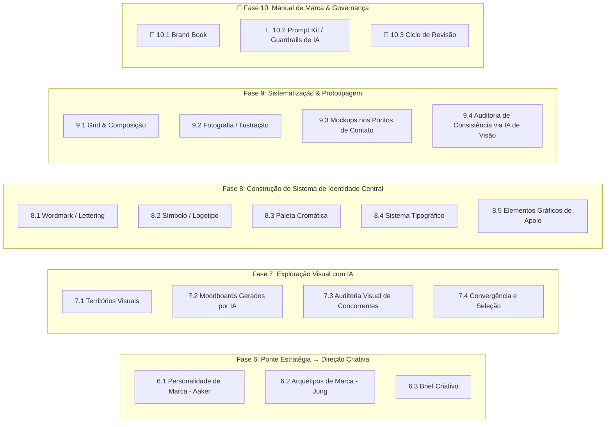

---
tags:
  - branding
tipo:
  - sintese
dominio:
  - branding
---
# Metodologia de Tradução: Da Estratégia à Identidade Visual (Wheeler + IA Generativa)

> **Parte II** da Metodologia Integrada de Branding — continuação direta de [[metodologia_vertix_brand_strategy_simplificada]]. A Parte I (Aaker + Neumeier) constrói o **significado** da marca. Esta Parte II traduz esse significado em **forma**: o sistema visual que as pessoas efetivamente veem, reconhecem e memorizam.

O eixo estrutural desta parte é o processo clássico de **Alina Wheeler** (_Designing Brand Identity_) — pesquisa, clarificação, design, criação de pontos de contato e gestão de ativos — adaptado em cinco fases e com um fluxo de trabalho assistido por IA generativa em cada uma delas.

---

## 🧭 Por que esse "elo" é necessário

O ONLY Statement, o Trueline e a Identidade Central resolvem a pergunta _"o que a marca significa e por que ela é única"_. Mas significado não se comunica sozinho — ele precisa de uma **linguagem sensorial** (forma, cor, tipografia, movimento, textura) que funcione como tradução consistente daquele significado em qualquer ponto de contato. Sem essa ponte, uma estratégia brilhante vira um documento na gaveta, e uma identidade visual bonita vira decoração sem lastro estratégico. As duas falhas são simétricas — e é exatamente essa lacuna que a Parte II fecha.

---

## 📥 Inputs recebidos da Parte I

|Input|Produzido em|Usado em|
|---|---|---|
|ONLY Statement|4.1|Critério de convergência (7.4) e teste de consistência (9.4)|
|Subconjunto Focal da Identidade|4.2|Brief criativo (6.3)|
|Trueline & Slogan|4.3|Territórios visuais (7.1), tom de voz do brief|
|Nome da marca|5.1|Wordmark / lettering (8.1)|
|Mapa de Pontos de Contato|5.2|Mockups e prototipagem (9.3)|
|Regras de Combate / Oceano Azul|5.3|Auditoria visual de concorrentes (7.3)|

---

## 🧭 Visão Geral do Framework

---

## Fase 6 — Ponte Estratégia → Direção Criativa

O objetivo desta fase é converter conceitos abstratos (posicionamento, identidade) em direcionadores concretos que um designer — humano ou IA — consiga usar.

**6.1 Personalidade de Marca (Aaker).** Traduza o Subconjunto Focal da Identidade nas cinco dimensões do _Brand Personality Framework_ de Aaker: Sinceridade, Excitação, Competência, Sofisticação, Rudeza (robustez). Isso já elimina boa parte da ambiguidade visual: uma marca "Excitação alta / Sofisticação baixa" pede tipografia e cor muito diferentes de uma "Competência alta / Sinceridade alta".

**6.2 Arquétipos de Marca (Jung).** Mapeie o ONLY Statement e o Trueline para um ou dois dos 12 arquétipos junguianos (Herói, Sábio, Criador, Explorador, Fora-da-Lei, Mago, Inocente, Cara-Comum, Amante, Bobo-da-Corte, Cuidador, Governante). O arquétipo funciona como atalho semântico: cada um já carrega associações visuais testadas (paletas, formas, tom fotográfico) que servem de ponto de partida.

> 🤖 **Papel da IA:** um LLM (Claude) é muito eficaz aqui como parceiro analítico — alimentado com o ONLY Statement, o Trueline e a Identidade Central, ele pode sugerir as dimensões de personalidade e os arquétipos mais coerentes, com justificativa explícita, funcionando como um "segundo leitor" que testa a consistência lógica entre estratégia e direção criativa antes de qualquer traço ser desenhado.

**6.3 Brief Criativo.** Documento-síntese (1-2 páginas) que reúne: personalidade, arquétipo, Trueline, o que a marca é / não é visualmente, referências a evitar, e restrições práticas (orçamento, aplicações prioritárias). Este brief é o único artefato que qualquer designer ou ferramenta de IA vai receber daqui em diante — ele isola a exploração visual das nuances estratégicas que só fazem sentido internamente.

> 🤖 **Papel da IA:** Claude redige a primeira versão do brief a partir dos artefatos da Parte I, já em formato pronto para orientar prompts de geração de imagem.

---

## Fase 7 — Exploração Visual com IA

**7.1 Territórios Visuais.** A partir do brief, defina 3-4 "territórios" antagônicos entre si (ex.: minimalista/geométrico vs. orgânico/artesanal; monocromático vs. multicolorido) — cada território é uma hipótese visual distinta para a mesma estratégia, não uma variação estética da mesma ideia.

**7.2 Moodboards Gerados por IA.** Para cada território, gere moodboards com ferramentas de geração de imagem (Midjourney, Ideogram 3, ou modelos como Flux 2 / Imagen 4) usando prompts estruturados diretamente a partir do brief — arquétipo, adjetivos de personalidade, paleta aproximada e referências setoriais. Ideogram 3 se destaca quando é preciso renderizar texto/tipografia dentro da imagem gerada, o que ajuda a testar wordmarks ainda no estágio de moodboard.

**7.3 Auditoria Visual de Concorrentes.** Reúna as identidades visuais dos concorrentes mapeados na Fase 1.2 e nas Regras de Combate (5.3) em um painel único. O objetivo é achar o "espaço em branco" visual — cores, formas ou tons que a categoria inteira já ocupa, e que portanto não devem ser usados, para garantir diferenciação radical também no plano visual (Oceano Azul aplicado à estética, não só à oferta).

**7.4 Convergência e Seleção.** Escolha o território vencedor testando-o contra o ONLY Statement: _essa direção visual comunica, sem palavras, o que só esta marca pode entregar?_ Se a resposta exigir explicação, o território ainda não está pronto.

> 🤖 **Papel da IA:** aqui a IA generativa de imagem faz o trabalho pesado de gerar volume e variedade em minutos — dezenas de direções visuais que levariam dias para um designer esboçar à mão. O julgamento sobre qual território comunica melhor a estratégia continua sendo uma decisão humana.

---

## Fase 8 — Construção do Sistema de Identidade Central

**8.1 Wordmark / Lettering.** Exploração tipográfica do nome da marca (Fase 5.1) dentro do território vencedor.

**8.2 Símbolo / Logotipo.** Geração de conceitos de símbolo com ferramentas de IA voltadas a vetor nativo, como o Recraft (gera SVG editável, treinável no estilo específico da marca) — ou geração raster em Midjourney/Ideogram seguida de vetorização manual. É importante tratar o resultado da IA como ponto de partida de refinamento, não como entregável final: questões de originalidade, direitos de uso comercial e ajuste fino de curvas/proporções ainda pedem edição humana em Illustrator ou Figma.

**8.3 Paleta Cromática.** Derive a paleta da personalidade de marca (6.1) e do arquétipo (6.2), não apenas do gosto pessoal — psicologia da cor tem correlação direta com as dimensões de Aaker. Use IA para extrair paletas de referências visuais aprovadas no moodboard e gerar variações, sempre validando contraste e acessibilidade (WCAG) antes de fechar.

**8.4 Sistema Tipográfico.** Defina o par tipográfico (display + texto) coerente com a personalidade. Ferramentas de IA podem sugerir pareamentos com base em atributos descritivos (ex.: "geométrica + humanista", "serifada editorial + sans neutra").

**8.5 Elementos Gráficos de Apoio.** Padrões, texturas, iconografia de apoio — gerados com _style transfer_ a partir dos ativos já aprovados, para garantir que cada novo elemento nasça consistente com o sistema, em vez de ser uma peça isolada.

> 🤖 **Papel da IA:** de motor de exploração (Fase 7) para motor de produção guiada — a IA já está trabalhando dentro de restrições definidas (paleta, arquétipo, wordmark aprovado), o que reduz drasticamente a variância dos resultados e o retrabalho.

---

## Fase 9 — Sistematização & Prototipagem

**9.1 Grid & Composição.** Regras de espaçamento, proporção e composição que vão orientar qualquer aplicação futura.

**9.2 Fotografia / Ilustração.** Diretriz de estilo (tom, enquadramento, tratamento de cor) para o banco de imagens da marca. Cuidado aqui: usar IA para gerar um banco de referência é útil para alinhar expectativa com times e fornecedores, mas produção final de imagem 100% sintética tende a "achatar" a marca em um visual genérico se não houver curadoria humana forte sobre o que fica e o que é descartado.

**9.3 Mockups nos Pontos de Contato.** Prototipar rapidamente a identidade nos pontos de contato mapeados na Fase 5.2 (embalagem, site, redes sociais, fachada, materiais impressos) antes de qualquer produção real — isso permite testar a robustez do sistema visual em contextos variados, não só isoladamente no logo.

**9.4 Auditoria de Consistência via IA de Visão.** Uma vez com um conjunto de mockups prontos, um modelo com capacidade de visão pode ser usado como auditor: recebe o manual de marca (ou um resumo dele) e as peças geradas, e aponta inconsistências de cor, proporção ou tom antes que cheguem ao cliente ou ao mercado.

> 🤖 **Papel da IA:** ferramentas de prototipagem rápida (mockup generators) comprimem o ciclo de "ver a marca em contexto" de semanas para horas — o valor está em testar cedo, errar barato, e só then produzir fisicamente.

---

## 🎯 Fase 10 — Manual de Marca & Governança

**🎯 10.1 Brand Book.** Documento final que reúne toda a Parte II: personalidade, arquétipo, logotipo e suas variações, paleta, tipografia, grid, tom fotográfico, exemplos de aplicação certa e errada.

**🎯 10.2 Prompt Kit / Guardrails de IA.** Artefato específico para a era da geração de conteúdo assistida por IA: um conjunto documentado de instruções de estilo (paleta em hex, adjetivos de tom, o que nunca incluir) que qualquer pessoa — ou qualquer IA — pode usar como prompt-base para gerar novas peças de marca sem perder consistência. Este é o elo entre a identidade visual formalizada aqui e o uso cotidiano de IA generativa daqui para frente.

**🎯 10.3 Ciclo de Revisão.** A identidade visual não é estática — defina uma cadência (ex.: anual) para reavaliar se o sistema ainda serve à estratégia, especialmente se a Parte I (posicionamento) for revisitada.

> 🤖 **Papel da IA:** Claude pode compilar e organizar o Brand Book a partir de todos os artefatos das Fases 6-9, e também gerar a primeira versão do Prompt Kit — transformando decisões de design já tomadas em instruções replicáveis.

---

## 🧩 Papel da IA por Etapa — Quadro-Resumo

|Fase|Papel da IA|Decisão continua humana?|
|---|---|---|
|6. Ponte estratégica|Sugerir personalidade/arquétipo, redigir o brief|Sim — validação da leitura estratégica|
|7. Exploração visual|Gerar volume de moodboards e variações|Sim — escolha do território vencedor|
|8. Identidade central|Gerar conceitos de logo, paleta, tipografia dentro de restrições|Sim — refinamento e aprovação final|
|9. Prototipagem|Gerar mockups rápidos; auditar consistência via visão computacional|Sim — decisão de produção real|
|10. Governança|Compilar o Brand Book; gerar o Prompt Kit|Sim — validação e manutenção do sistema|

---

## 🛠️ Panorama de Ferramentas de IA (2026)

- **LLM de apoio estratégico e redação** (Claude): brief criativo, leitura de arquétipos, compilação do Brand Book, geração do Prompt Kit.
- **Geração de imagem para moodboard/exploração**: Midjourney (estética artística), Ideogram 3 (melhor renderização de texto/wordmark), modelos como Flux 2 e Imagen 4.
- **Geração de vetor nativo para logo e ícones**: Recraft — diferencial de exportar SVG editável e permitir treinamento no estilo visual da própria marca, reduzindo a necessidade de vetorização manual.
- **Kits de marca rápidos e acessíveis** (bom para MVP ou orçamento restrito): Looka, Brandmark, Canva Magic Studio — geram logotipo + aplicações básicas em poucos minutos, mas exigem curadoria humana para não soarem genéricos.
- **Prototipagem de mockups e aplicações**: Canva e Figma (com recursos de IA) para simular a marca em contexto real rapidamente.

> ⚠️ Questões de direitos autorais sobre outputs puramente gerados por IA ainda estão em definição em várias jurisdições — vale tratar peças centrais (logo final) como resultado de um processo híbrido IA + refinamento humano documentado, não como output bruto de uma ferramenta.

---

## 🎯 Princípio Orientador

A IA acelera **exploração** e **execução** — ela pode gerar em minutos o volume de variações visuais que levaria dias para produzir manualmente. Mas ela não decide **significado**. As Fases 1 a 5 (Parte I) permanecem território exclusivamente humano e estratégico; as Fases 6 a 10 (Parte II) são onde a IA atua como parceira ativa, sempre dentro dos limites que a estratégia já definiu. Perder essa hierarquia — deixar a ferramenta escolher o território, o arquétipo ou o posicionamento — é o caminho mais rápido para uma identidade visual bonita e vazia.