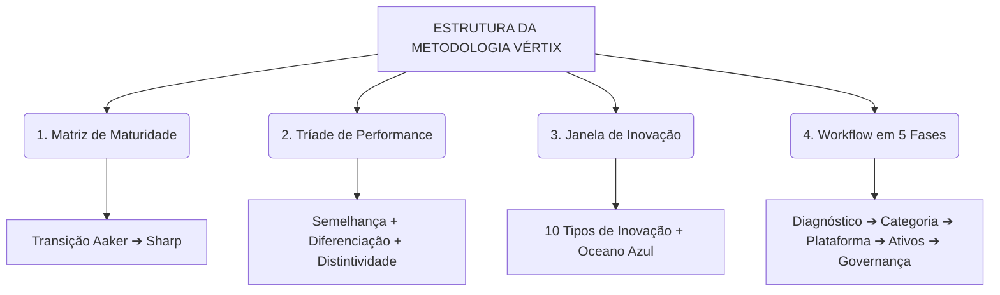
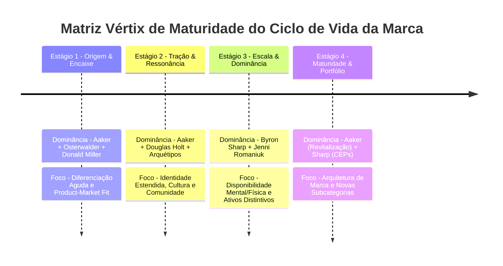
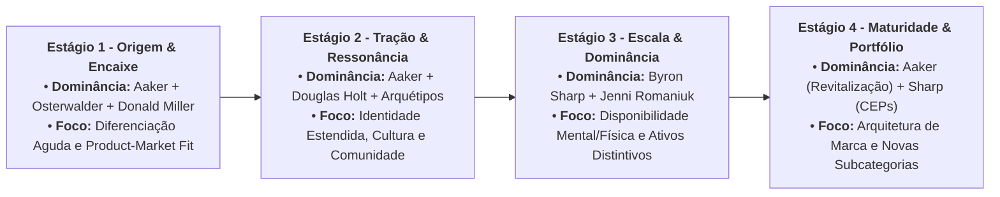
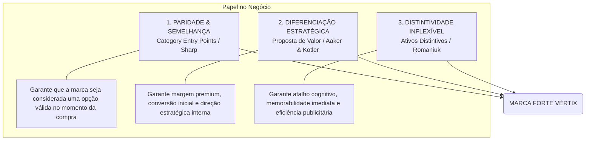
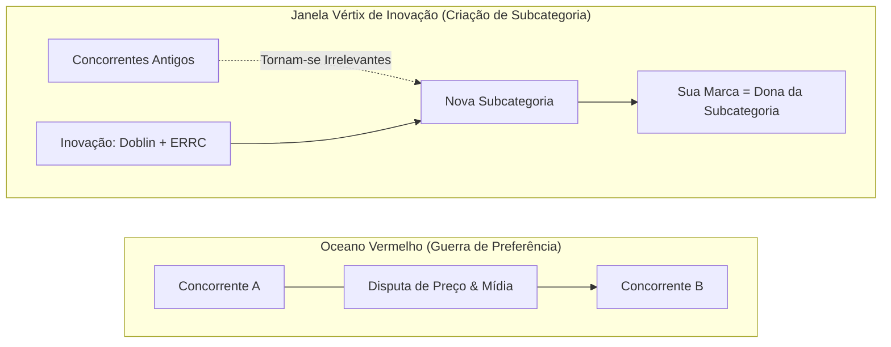
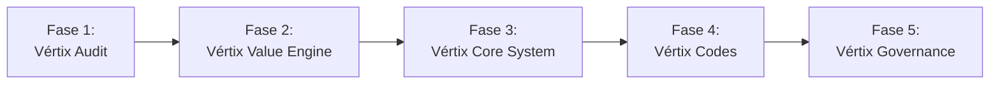
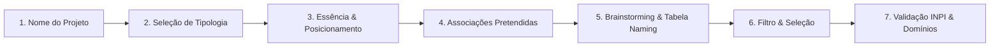
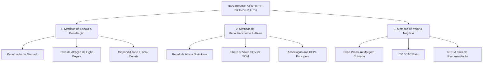

# MÉTODO VÉRTIX DE BRAND STRATEGY™
## Manual Definitivo de Criação, Inovação, Posicionamento e Gestão de Marcas

> **Autor**: Caio E. & Antigravity  
> **Versão**: 1.0 (Edição Definitiva)  
> **Propriedade**: Metodologia Autoral proprietária de Brand Strategy  
> **Data**: Agosto de 2026  

---

## SUMÁRIO EXECUTIVO

1. **MANIFESTO & FILOSOFIA VÉRTIX**
   - O Conceito de Crescimento Vertical & Inovação X
   - A Superação dos Dogmas: A Conciliação das Escolas de Branding
2. **A MATRIZ VÉRTIX DE MATURIDADE DA MARCA**
   - Estágio 1: Origem & Encaixe (Zero to One)
   - Estágio 2: Tração & Ressonância Cultural (One to Ten)
   - Estágio 3: Escala & Dominância de Mercado (Ten to Hundred)
   - Estágio 4: Maturidade, Arquitetura & Revitalização (Hundred to Beyond)
3. **A TRÍADE VÉRTIX DE PERFORMANCE DE MARCA**
   - Paridade & Semelhança (Category Entry Points - CEPs)
   - Diferenciação Estratégica (Strategic Point of Difference)
   - Distintividade Inflexível (Distinctive Brand Assets Grid)
4. **O MOTOR DE INOVAÇÃO DE CATEGORIA (JANELA VÉRTIX)**
   - Relevância de Marca vs. Preferência de Marca
   - Os 10 Tipos de Inovação (Doblin) Aplicados ao Branding
   - A Matriz ERRC (Oceano Azul) e a Criação/Hackeragem de CEPs
5. **O WORKFLOW PRÁTICO EM 5 FASES DA METODOLOGIA VÉRTIX**
   - **Fase 1: Imersão, Auditoria & Diagnóstico (*Vértix Audit*)**
   - **Fase 2: Engenharia de Categoria & Valor (*Vértix Value Engine*)**
   - **Fase 3: Plataforma de Marca & Narrativa Central (*Vértix Core System*)**
   - **Fase 4: Identidade Verbal/Visual & Ativos Distintivos (*Vértix Codes*)**
   - **Fase 5: Experiência, Governança & Dashboard (*Vértix Governance*)**
6. **PROCESSO ESTRATÉGICO DE NAMING (MÉTODO VÉRTIX SNP)**
   - As 6 Tipologias de Naming
   - Roteiro de Brainstorming, Tabela de Naming e Validação INPI
7. **GUIA DE FERRAMENTAS, CHECKLISTS E KPIS**
   - Checklists por Fase de Execução
   - Matriz de Indicadores de Saúde de Marca (*Brand Health Tracker*)

---

# 1. MANIFESTO & FILOSOFIA VÉRTIX

### 1.1 A Origem da Metodologia
O **Método Vértix de Brand Strategy™** nasce para resolver a maior crise do marketing contemporâneo: a fragmentação teórica e o dogmatismo raso. 

De um lado, a **Escola Clássica** (David Aaker, Philip Kotler, Marty Neumeier) defende que marcas sobrevivem unicamente por meio de posicionamento agudo, identidade profunda e diferenciação única. Do outro lado, a **Escola Científico-Empírica** (Byron Sharp, Jenni Romaniuk / *Ehrenberg-Bass Institute*) argumenta que a diferenciação é uma ilusão estatística e que marcas crescem exclusivamente por disponibilidade mental/física, ativos distintivos e alcance massivo.

O **Método Vértix** recusa o alinhamento cego a qualquer um dos lados. Entendemos que:
* A visão purista do Byron Sharp é **leviana** quando aplicada a empresas no "Dia Zero", startups, B2B ou mercados de alto envolvimento.
* A visão clássica de Aaker é **insuficiente** quando a marca atinge a fase de escala massiva e precisa vender para compradores casuais (*light buyers*).

O nome **VÉRTIX** sintetiza essa reconciliação:
* **VÉRTICE / APEX**: A busca constante pelo ponto culminante da liderança de mercado.
* **VERTICALIDADE**: O gráfico de tração sustentável, inclinado e escalável que o negócio almeja.
* **TECNOLOGIA X**: O sufixo de inovação, dados, precisão e contemporaneidade digital.

---

### 1.2 O Prisma da Contextualidade
O Método Vértix estabelece que a estratégia de marca não é uma fórmula estática, mas uma equação sensível ao contexto:

$$\text{Estratégia Vértix} = f(\text{Estágio de Maturidade}, \text{Grau de Envolvimento}, \text{Disrupção da Categoria})$$



---

# 2. A MATRIZ VÉRTIX DE MATURIDADE DA MARCA

A **Matriz Vértix de Maturidade** determina qual escola teórica deve **predominar** em cada fase do ciclo de vida da empresa.



Um zoom mais detalhado:


---

### 2.1 Detalhamento dos 4 Estágios

#### **ESTÁGIO 1: ORIGEM & ENCAIXE (Zero to One)**
* **Dominância Teórica**: David Aaker (Core Identity) + Alexander Osterwalder (Value Proposition Design) + Donald Miller (Storybrand).
* **Desafio do Negócio**: Sobrevivência, validação da oferta e tração inicial em um mercado de nicho (*Beachhead Market*).
* **Papel do Branding Vértix**:
  * Definir uma **Proposta de Valor Aguda e Diferenciada** que resolva uma dor crítica que a concorrência ignora.
  * Estruturar a **Narrativa SB7 (Miller)**: Cliente como Herói, Marca como Guia com um plano claro de 3 passos.
  * Estabelecer **Ativos Distintivos Embriionários (Romaniuk)**: Definir 2 a 3 códigos visuais/verbais fundamentais para evitar rebrandings desnecessários no futuro.
* **Métrica Central**: *Product-Market Fit* (PMF) e Taxa de Conversão de Clientes Iniciais.

#### **ESTÁGIO 2: TRAÇÃO & RESSONÂNCIA CULTURAL (One to Ten)**
* **Dominância Teórica**: David Aaker (Sistema de Identidade) + Douglas Holt (Cultural Branding) + Carol Pearson (Arquétipos).
* **Desafio do Negócio**: Sair do nicho puramente funcional, construir reputação sólida, retenção e lealdade de super-fãs.
* **Papel do Branding Vértix**:
  * **Sistema de Identidade (Aaker)**: Formalizar a Identidade Core e Estendida (Marca como Pessoa, Organização e Símbolo).
  * **Branding Cultural (Holt)**: Conectar a marca a uma *tensão cultural* vigente na sociedade, transformando o consumo em ato identitário.
  * **Arquétipos & Tom de Voz**: Alinhamento psicológico e criação de um vocabulário proprietário.
* **Métrica Central**: *LTV (Lifetime Value)*, *NPS*, *Advocacy* e Retention Rate.

#### **ESTÁGIO 3: ESCALA & DOMINÂNCIA DE MERCADO (Ten to Hundred)**
* **Dominância Teórica**: Byron Sharp & Jenni Romaniuk (*How Brands Grow* & *Building Distinctive Assets*).
* **Desafio do Negócio**: A base de super-fãs saturou. Para continuar crescendo, a marca precisa vender para compradores casuais (*light buyers*).
* **Papel do Branding Vértix**:
  * **Disponibilidade Mental**: Mapear e ocupar sistematicamente os *Category Entry Points* (CEPs) — as pistas mentais e momentos de necessidade do consumidor.
  * **Disponibilidade Física**: Expansão agressiva de canais, presença e facilidade de compra.
  * **Ativos Distintivos Inflexíveis**: Blindagem e aplicação rigorosa da Grade de Ativos Distintivos (Logos, Cores, Slogans, Personagens) em mídia de grande alcance (*Mass Reach*).
* **Métrica Central**: *Penetração de Mercado*, *Market Share*, *Share of Voice (SOV)* e *Recall de Ativos Distintivos*.

#### **ESTÁGIO 4: MATURIDADE, ARQUITETURA & REVITALIZAÇÃO (Hundred to Beyond)**
* **Dominância Teórica**: David Aaker (Brand Equity & Revitalization) + Byron Sharp (Gestão de Portfólio).
* **Desafio do Negócio**: Risco de desaceleração, commoditização da categoria principal ou obsolescência.
* **Papel do Branding Vértix**:
  * **Arquitetura de Marca (Aaker)**: Estruturação do modelo de marca (*Branded House*, *House of Brands* ou *Endorsed Brands*) para lançar sub-marcas e invadir novas categorias.
  * **Revitalização de Marca**: Atualização estética dos ativos distintivos sem perder o patrimônio de reconhecimento histórico.
* **Métrica Central**: *Valuation de Marca*, Margem Premium (*Price Premium*) e Retorno sobre Portfólio.

---

# 3. A TRÍADE VÉRTIX DE PERFORMANCE DE MARCA

Para garantir que a marca seja simultaneamente reconhecida, desejada e comprada, o Método Vértix exige o equilíbrio de **3 Forças Complementares**:



### 3.1 Os Três Pilares da Tríade
1. **Paridade / Semelhança (Category Entry Points - CEPs)**: A marca atende aos códigos e requisitos mínimos esperados da categoria. Se a marca vende software de gestão, precisa parecer um software confiável para entrar na lista de consideração (*Consideration Set*).
2. **Diferenciação Estratégica (Strategic Point of Difference)**: A razão clara e defensável do porquê o cliente deve escolher esta marca e pagar mais por ela. Define o direcionamento do produto, cultura corporativa e argumentos de vendas.
3. **Distintividade Inflexível (Distinctive Brand Assets)**: A roupagem sensorial única (visuais, sons, formas, nomes) que faz a marca ser reconhecida em 0,1 segundo, sem necessidade de ler o nome.

---

# 4. O MOTOR DE INOVAÇÃO DE CATEGORIA (JANELA VÉRTIX)

Uma marca não cresce apenas lutando por participação de mercado em categorias saturadas (*Preferência de Marca*). As marcas líderes constroem seu crescimento **criando ou redefinindo novas subcategorias (*Relevância de Marca*)**.



### 4.1 Aplicação dos 10 Tipos de Inovação (Larry Keeley / Doblin)
O Método Vértix utiliza os 10 Tipos de Inovação para desenhar a brecha estratégica da marca antes de iniciar a comunicação:

1. **CONFIGURAÇÃO (Interno)**:
   * *Modelo de Lucro*: Mudar a forma de cobrança (ex.: Assinatura, Freemium, Pay-per-use).
   * *Rede*: Alianças estratégicas e ecossistemas.
   * *Estrutura*: Organização de talentos e ativos operacionais.
   * *Processo*: Métodos proprietários de entrega.
2. **OFERTA (Produto)**:
   * *Desempenho do Produto*: Atributos e funcionalidades superiores.
   * *Sistema de Produto*: Produtos e serviços complementares que se conectam.
3. **EXPERIÊNCIA (Cliente)**:
   * *Serviço*: Suporte e experiência pré/pós-venda extraordinária.
   * *Canal*: Formas inéditas de entregar a solução (ex.: D2C, 100% Digital).
   * *Marca*: Posicionamento e valores diferenciados.
   * *Envolvimento do Cliente*: Comunidades e conexões emocionais profundas.

---

### 4.2 A Matriz ERRC (Estratégia do Oceano Azul)
Para criar a nova subcategoria, a marca deve preencher a Matriz ERRC:
* **ELIMINAR**: Quais fatores aceitos pela categoria há tempos devem ser totalmente eliminados?
* **REDUZIR**: Quais fatores devem ser reduzidos bem abaixo dos padrões da categoria?
* **ELEVAR**: Quais fatores devem ser elevados muito acima dos padrões da categoria?
* **CRIAR**: Quais fatores nunca oferecidos pela categoria devem ser criados do zero?

---

# 5. O WORKFLOW PRÁTICO EM 5 FASES DA METODOLOGIA VÉRTIX

O processo de execução do **Método Vértix** é estruturado em 5 fases cronológicas e cumulativas.



---

## FASE 1: IMERSÃO, AUDITORIA & DIAGNÓSTICO (*Vértix Audit*)
* **Objetivo**: Mapear o contexto competitivo, as dores do consumidor, os clichés da categoria e diagnosticar o estágio atual de maturidade da empresa.

### Passos de Execução:
1. **Auditoria de Negócio & Ecossistema**: Análise de portfólio, margens, taxa de retenção e histórico de vendas.
2. **Pesquisa de Consumidor & Mapeamento de CEPs**: Entrevistas qualitativas para identificar quais gatilhos mentais e situações de vida ativam a necessidade do produto (*Category Entry Points*).
3. **Auditoria do Mar Saturado da Categoria**: Mapeamento visual e verbal de todos os concorrentes para identificar os clichés (promessas e cores genéricas que geram invisibilidade).
4. **Enquadramento na Matriz Vértix de Maturidade**: Classificação nos Estágios 1, 2, 3 ou 4 para calibrar os pesos das fases seguintes.

* 📦 **Entregável Principal**: **Relatório Vértix Audit & Mapeamento de Oportunidades**.

---

## FASE 2: ENGENHARIA DE CATEGORIA & VALOR (*Vértix Value Engine*)
* **Objetivo**: Desenhar a brecha de inovação e o encaixe perfeito entre a proposta de valor da marca e as necessidades do cliente.

### Passos de Execução:
1. **Aplicação dos 10 Tipos de Inovação**: Escolha de 2 a 3 alavancas de inovação (Configuração, Oferta ou Experiência).
2. **Desenho da Matriz ERRC (Oceano Azul)**: Definição dos vetores de eliminação, redução, elevação e criação.
3. **Value Proposition Design (Osterwalder)**:
   * *Perfil do Cliente*: Mapeamento de Tarefas (*Customer Jobs*), Dores (*Pains*) e Ganhos (*Gains*).
   * *Mapa de Valor*: Produtos/Serviços, Aliviadores de Dores e Criadores de Ganhos.
4. **Declaração de Redefinição de Categoria (*Brand Relevance Statement*)**: Formalizar a nova subcategoria criada pela marca.

* 📦 **Entregável Principal**: **Canvas Vértix Value Engine & Declaração de Categoria**.

---

## FASE 3: PLATAFORMA DE MARCA & NARRATIVA CENTRAL (*Vértix Core System*)
* **Objetivo**: Construir a espinha dorsal estratégica, o posicionamento, a personalidade e a história da marca.

### Passos de Execução:
1. **Sistema de Identidade de Marca (Aaker)**:
   * **Core Identity (Essência)**: As 2 a 4 crenças inegociáveis.
   * **Extended Identity**: A marca como Produto, Organização, Pessoa e Símbolo.
2. **Tensão Cultural & Propósito Simbólico (Holt)**: Mapeamento da contradição cultural ou ideologia que a marca defende perante a sociedade.
3. **Roteiro Narrativo SB7 (Storybrand / Miller)**:
   * *O Cliente (Herói)* + *O Problema (Vilão)* + *A Marca (Guia com Empatia e Autoridade)* + *O Plano de 3 Passos* + *A Chamada para Ação* + *O Sucesso vs. O Fracasso Evitado*.
4. **Arquétipos & Tom de Voz (Pearson & Mark)**: Arquétipo Primário e Secundário, Guia de Tom de Voz (*Como falamos vs. Como NUNCA falamos*) e Vocabulário Proprietário.

* 📦 **Entregável Principal**: **Vértix Brand Platform & Master Narrative Guide (Manifesto e Guia Verbal)**.

---

## FASE 4: IDENTIDADE VERBAL/VISUAL & ATIVOS DISTINTIVOS (*Vértix Codes*)
* **Objetivo**: Criar ou reformular a identidade visual/verbal da marca, transformando o Naming, Logotipo e Design System na grade de ativos distintivos de alto reconhecimento (Jenni Romaniuk).

### Passos de Execução:
1. **Criação de Naming (Processo Vértix SNP)**:
   * Quando o projeto for do zero, aplicação das 6 Tipologias de Naming (Descritivo, Associativo, Antropônimo, Topônimo, Acrônimo, Transgressor).
   * Filtros de concisão, facilidade de pronúncia, sonoridade amigável (*friendly*) e pesquisa prévia no INPI / Domínios.
2. **Design da Assinatura Visual (Logotipo & Símbolo)**:
   * Criação de logotipo e símbolo original, fugindo dos clichés do "mar saturado" identificados na Fase 1.
3. **Engenharia da Grade de Ativos Distintivos (Romaniuk)**:
   * *Códigos Visuais*: Paleta de cor proprietária, formas geométricas de apoio, tipografia de marca, estilo fotográfico/ilustrativo.
   * *Códigos Verbais*: Taglines, slogans, nomenclatura de produtos, jargões proprietários.
   * *Códigos Sensoriais/Auditivos*: Sound logos, embalagens táticas ou aromas.
4. **Teste da Grade de Ativos (Famoso vs. Único)**:
   * Avaliação da capacidade dos ativos em gerar reconhecimento rápido e associação exclusiva à marca.
5. **Design System & Manual de Aplicação**:
   * Construção das diretrizes de aplicação em múltiplos pontos de contato digitais e físicos.

* 📦 **Entregável Principal**: **Manual Vértix Codes & Visual/Verbal Design System**.

---

## FASE 5: EXPERIÊNCIA DE MARCA, GOVERNANÇA & DASHBOARD (*Vértix Governance*)
* **Objetivo**: Ativar a marca nos pontos de contato (BX), alinhar o time interno (*Employer Branding*) e medir continuamente a eficiência da estratégia.

### Passos de Execução:
1. **Mapeamento da Jornada BX (Brand Experience)**: Alinhamento de todos os pontos de contato da jornada (pré, durante e pós-venda) à proposta de valor e narrativa da marca.
2. **Plano de Ativação de CEPs em Mídia**: Campanhas focadas em conectar os Ativos Distintivos aos *Category Entry Points* prioritários.
3. **Governança Interna & Aculturamento (Employer Branding)**: Treinamento e rituais com colaboradores para garantir que a promessa da marca seja entregue na operação real.
4. **Dashboard Vértix Brand Health Tracker**:
   * Implementação do painel de controle de indicadores divididos entre Escala (Sharp), Reconhecimento (Romaniuk) e Valor de Negócio (Aaker/Kotler).

* 📦 **Entregável Principal**: **Playbook Vértix Governance, Guia de Experiência & Dashboard de Métricas**.

---

# 6. PROCESSO ESTRATÉGICO DE NAMING (MÉTODO VÉRTIX SNP)

Quando o projeto exigir a criação de um novo nome (para empresa, produto ou sub-marca), a Fase 4 utiliza o **Vértix Strategic Naming Process (SNP)** baseado nas obras de referência de Naming:



### 6.1 As 6 Tipologias de Naming
1. **Descritivos**: Explicam diretamente a função (ex.: *Google Ads*, *Telefónica*). Didáticos, ótimos para B2B e produtos técnicos.
2. **Associativos**: Sugerem conceitos, emoções ou atributos sem descrição literal (ex.: *iFood*, *Natura*, *Waze*). Seguros e escaláveis.
3. **Antropônimos**: Nomes de pessoas, fundadores ou figuras ícone (ex.: *Walt Disney*, *Lacoste*, *Ayrton Senna*). Trazem personalização e prestígio.
4. **Topônimos**: Nomes de lugares ou referências geográficas (ex.: *Arezzo*, *Kopenhagen*, *Ferrari Modena*). Emprestam status e origem.
5. **Acrônimos**: Siglas formadas por iniciais (ex.: *IBM*, *BMW*, *3M*, *HP*). Transmitem autoridade, escala e neutralidade corporativa.
6. **Transgressores**: Palavras inventadas/neologismos sem associação prévia (ex.: *Apple*, *Vértix*, *NuBank*). Total folha em branco, alta distintividade e apelo moderno.

---

### 6.2 Estrutura da Tabela de Naming (SNP)
O brainstorming deve ser plotado em uma matriz que cruza **Tipos de Nome** vs. **Atributos Pretendidos**:

| TIPOLOGIA | ATRIBUTO 1 (Ex.: Crescimento) | ATRIBUTO 2 (Ex.: Friendly) | ATRIBUTO 3 (Ex.: Inovação) |
| :--- | :--- | :--- | :--- |
| **Descritivos** | *Escala Certa* | *Marca Fácil* | *Tech Direct* |
| **Associativos** | *Pulse* | *Bloom* | *Compass* |
| **Antropônimos** | *Vértix Co.* | *Studio V* | *Vértix Lab* |
| **Acrônimos** | *R.I.S.E.* | *S.E.E.D.* | *P.A.C.E.* |
| **Transgressores** | *Scalio* | *Brandly* | *Vértix* |

---

# 7. GUIA DE FERRAMENTAS, CHECKLISTS E KPIS

### 7.1 Checklist de Validação por Fase

```markdown
- [ ] FASE 1 (Diagnóstico)
  - [ ] Mapeamento de no mínimo 5 Category Entry Points (CEPs) do segmento.
  - [ ] Auditoria visual e verbal de pelo menos 3 concorrentes diretos.
  - [ ] Enquadramento confirmado na Matriz Vértix de Maturidade (Estágio 1, 2, 3 ou 4).

- [ ] FASE 2 (Engenharia de Categoria)
  - [ ] Seleção de pelo menos 2 alavancas dos 10 Tipos de Inovação.
  - [ ] Matriz ERRC preenchida (Eliminar, Reduzir, Elevar, Criar).
  - [ ] Encaixe validado no Value Proposition Design (Pains/Gains vs Aliviadores/Criadores).

- [ ] FASE 3 (Plataforma & Narrativa)
  - [ ] Sistema de Identidade Aaker definido (Core Identity + Extended Identity).
  - [ ] Roteiro SB7 Storybrand estruturado (Cliente = Herói, Marca = Guia).
  - [ ] Tom de Voz e Arquétipos formalizados com vocabulário proprietário.

- [ ] FASE 4 (Ativos Distintivos & Naming)
  - [ ] Grade de Ativos Distintivos selecionada (Cores, Slogan, Tipografia, Símbolo).
  - [ ] Teste de Distintividade realizado (Ativos testados isoladamente sem o logo).
  - [ ] Se houver Naming: Busca prévia de anterioridade aprovada no INPI e domínios livres.

- [ ] FASE 5 (Experiência & Governança)
  - [ ] Jornada BX mapeada nos pontos de contato críticos.
  - [ ] Rituais de aculturamento interno (Employer Branding) agendados.
  - [ ] Dashboard de métricas Vértix configurado e ativo.
```

---

### 7.2 O Dashboard Vértix de Saúde de Marca (*Brand Health Tracker*)

A gestão da marca após a implementação é acompanhada por um painel de indicadores divididos em **3 Dimensões de Performance**:



| Dimensão | Indicador | Métrica de Avaliação | Frequência de Medição |
| :--- | :--- | :--- | :--- |
| **Escala (Sharp)** | Penetração de Mercado | % de compradores da categoria que compraram a marca no período | Trimestral |
| **Escala (Sharp)** | Taxa de Light Buyers | % de vendas vindas de clientes de baixa frequência | Semestral |
| **Escala (Sharp)** | Disponibilidade Física | % de cobertura de canais e facilidade de acesso | Mensal |
| **Reconhecimento (Romaniuk)** | Atribuição de Ativos | % de pessoas que reconhecem os ativos visuais/verbais sem o logo | Semestral |
| **Reconhecimento (Romaniuk)** | Ocupação de CEPs | % de associação da marca às situações de compra prioritárias | Trimestral |
| **Reconhecimento (Romaniuk)** | SOV vs. SOM Ratio | Comparativo entre parcela de voz em mídia (*SOV*) e parcela de mercado (*SOM*) | Mensal |
| **Valor de Negócio (Aaker/Kotler)** | Price Premium | % de preço acima da média da categoria que a marca consegue sustentar | Semestral |
| **Valor de Negócio (Aaker/Kotler)** | LTV / CAC | Razão entre o valor do tempo de vida do cliente e o custo de aquisição | Mensal |
| **Valor de Negócio (Aaker/Kotler)** | NPS (Net Promoter Score) | Índice de recomendação voluntária da marca pelos clientes | Mensal |

---

## CONCLUSÃO

O **Método Vértix de Brand Strategy™** transforma o Branding de uma atividade puramente estética ou teórica em um **sistema integrado de engenharia de negócios, inovação e ativo financeiro intangível**.

Ao aliar a **Diferenciação e Narrativa (Aaker, Holt, Miller)** nas fases iniciais à **Distintividade e Disponibilidade Massiva (Byron Sharp, Romaniuk)** nas fases de escala, a marca ganha tração acelerada no presente e sustentabilidade defensável no futuro.

***

*Documento gerado e consolidado para Caio E. — Método Vértix de Brand Strategy™ (2026).*
