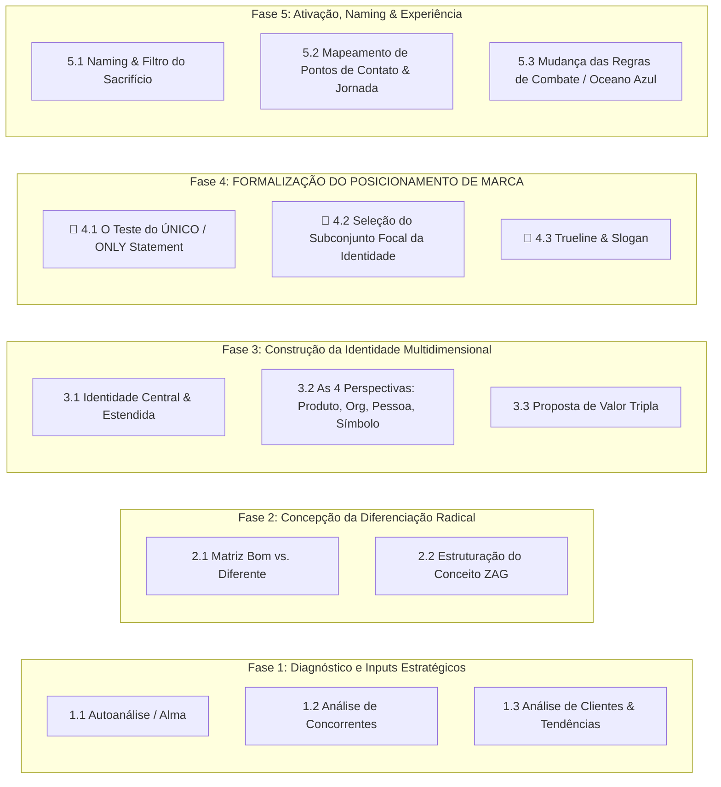

---
tags:
  - branding
tipo:
  - sintese
dominio:
  - branding
---
# Metodologia Integrada de Branding: Aaker & Neumeier

Esta metodologia unifica o **Sistema de Identidade e Brand Equity de David Aaker** (*Building Strong Brands*) com o processo de **Diferenciação Radical e Foco de Marty Neumeier** (*ZAG*).

Ela conecta o diagnóstico de mercado, a construção da identidade multidimensional, a formalização do posicionamento e a implementação nos pontos de contato.

---

## 🧭 Visão Geral do Framework

