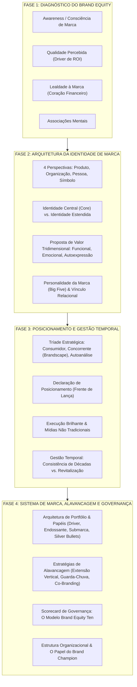
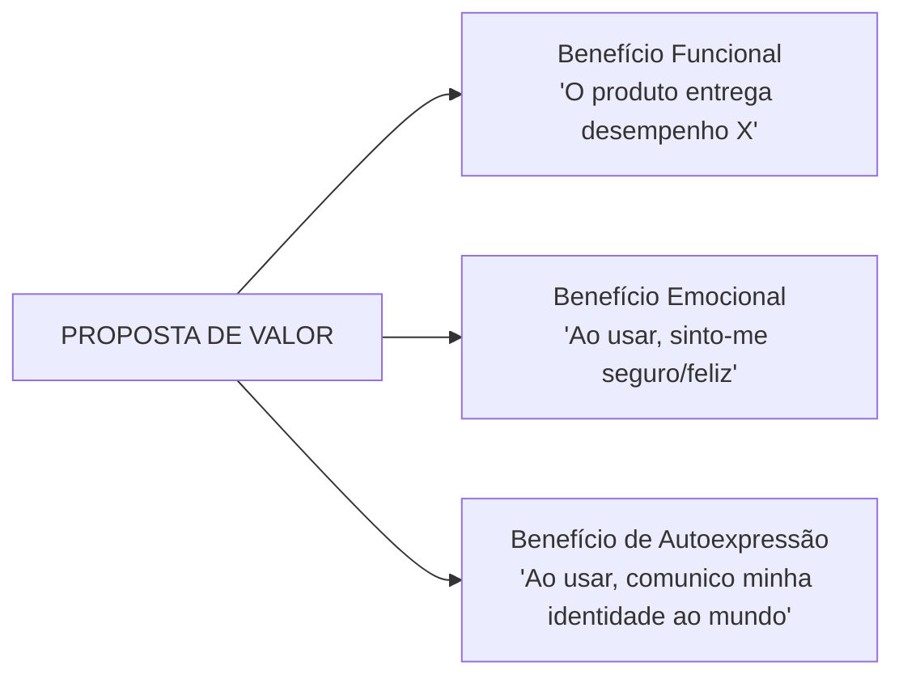

---
tags:
  - marketing
  - branding
  - estrategia
  - framework
livro: Building Strong Brands
autor: David A. Aaker
---

# 🛡️ O Framework Mestre de Gestão Estratégica de Marcas (Modelo Aaker Integrado)

> **Um guia metodológico passo a passo que sintetiza toda a obra *Building Strong Brands* de David A. Aaker para criação, posicionamento, alavancagem, mensuração e governança de marcas fortes.**

---

## 🗺️ Visão Holística do Framework Mestre



---

# 📋 As 4 Etapas do Framework em Detalhes

---

## ESTRUTURA 1: DIAGNÓSTICO E ATIVOS DO BRAND EQUITY
*(Fundamentação Financeira e Estratégica)*

O **Brand Equity** é o conjunto de ativos (e passivos) associados ao nome e símbolo da marca que adicionam ou subtraem valor da empresa e de seus clientes.

```
                   MATRIZ DOS 4 ATIVOS DO BRAND EQUITY
┌───────────────────────────┬───────────────────────────────────────────────────┐
│ ATIVO DE MARCA            │ FOCO E INDICADORES CHAVE                          │
├───────────────────────────┼───────────────────────────────────────────────────┤
│ 1. Consciência de Marca   │ • Do Reconhecimento ao Recall e Top-of-Mind.      │
│    (Brand Awareness)      │ • Evitar a Armadilha do Cemitério (Graveyard):    │
│                           │   reconhecimento alto com baixa lembrança.        │
├───────────────────────────┼───────────────────────────────────────────────────┤
│ 2. Qualidade Percebida    │ • Único ativo comprovadamente ligado ao ROI direto.│
│    (Perceived Quality)    │ • Foco nos sinais e atalhos perceptivos (cues).   │
├───────────────────────────┼───────────────────────────────────────────────────┤
│ 3. Lealdade à Marca       │ • Coração financeiro (reduz CAC e blinda margem). │
│    (Brand Loyalty)        │ • Segmentar: Sensíveis a Preço, Passivos,         │
│                           │   Indecisos e Compromissados.                     │
├───────────────────────────┼───────────────────────────────────────────────────┤
│ 4. Associações à Marca    │ • Os ganchos mentais que ancoram a escolha.       │
│    (Brand Associations)   │ • Guiadas diretamente pela Identidade da Marca.   │
└───────────────────────────┴───────────────────────────────────────────────────┘
```

---

## ESTRUTURA 2: ARQUITETURA DA IDENTIDADE DE MARCA
*(Definição da Alma e Proposta de Valor)*

A **Identidade da Marca** é a visão estratégica de futuro: como a organização aspira ser percebida na mente do consumidor.

### 1. Filtragem através das 4 Perspectivas
Ao desenhar a marca, examine-a sob 4 lentes complementares:
- **Marca como Produto**: Escopo da categoria, atributos funcionais, qualidade, ocasiões de uso, perfil de usuários e país de origem.
- **Marca como Organização**: Cultura interna, valores socioambientais, inovação e programas corporativos (inimitáveis pela concorrência).
- **Marca como Pessoa**: Personalidade da marca mensurada pelos *Big Five* (Sinceridade, Excitação, Competência, Sofisticação, Robustez).
- **Marca como Símbolo**: Imagens visuais icônicas, metáforas memoráveis e herança histórica (*Brand Heritage*).

### 2. Divisão Estrutural da Identidade
- **Identidade Central (*Core Identity*)**: A essência atemporal e imutável (2 a 4 associações primárias que nunca mudam ao expandir mercados).
- **Identidade Estendida (*Extended Identity*)**: Elementos detalhados, slogans, mascotes e símbolos que trazem textura e completude.

### 3. A Proposta de Valor Tridimensional


---

## ESTRUTURA 3: POSICIONAMENTO E GESTÃO TEMPORAL
*(A Lança Estratégica e a Consistência ao Longo das Décadas)*

### 1. A Tríade da Análise Estratégica
Antes de definir o posicionamento, cruze informações de 3 origens:
1. **Análise do Consumidor**: Motivações funcionais/emocionais e necessidades não atendidas.
2. **Análise do Concorrente**: Mapeamento do *Brandscape*, identificação de clusters saturados e busca por vulnerabilidades do rival.
3. **Autoanálise da Empresa**: Herança histórica (*Brand Heritage*), recursos reais e a **Alma da Marca (*Brand Soul*)**.

### 2. A Declaração de Posicionamento (*Brand Position*)
O posicionamento é a frente de lança ativamente comunicada hoje para um público-alvo específico:
- **Tarefas em Relação à Imagem Atual**: *Aumentar* (adicionar associações), *Reforçar* (explorar forças) ou *Suavizar/Deletar* (apagar traços ultrapassados).
- **Ponto de Vantagem**: Ressoar com o cliente e ter diferenciação competitiva.

### 3. As 4 Regras de Ouro da Consistência Temporal
1. **Manter a Identidade Central**: Mudar a execução publicitária é saudável; mudar a essência a cada 2 anos destrói o *Brand Equity*.
2. **Evitar a Armadilha do Tédio Interno**: Os executivos se cansam da propaganda antes dos consumidores.
3. **Evitar o Ataque de Pânico**: Não abandonar marcas leais para perseguir modismos sem testar alternativas.
4. **Revitalizar com Inteligência (*Heritage Brands*)**:
   - *Evoluir*: Slogans e logos sem mudar o Core.
   - *Aumentar*: Lançar inovações de produto que reforcem a promessa (ex: *Jell-O Jigglers*, *Quaker em copos*).
   - *Resgatar*: Reconectar a comunicação a símbolos icônicos da herança histórica.

---

## ESTRUTURA 4: SISTEMA DE MARCA, ALAVANCAGEM E GOVERNANÇA
*(Portfólio, Expansão, Métricas e Governança Corporativa)*

### 1. Arquitetura de Portfólio e Papéis de Marca
- **Marca Corporativa**: Aval institucional de credibilidade (*Endorser Role*).
- **Marca Guarda-Chuva (*Range Brand*)**: Cobre múltiplas categorias de produto (ex: *Healthy Choice, Virgin*).
- **Marca de Linha**: Produto específico na categoria (ex: *Chevrolet Lumina*).
- **Submarca**: Refina, qualifica ou modifica a marca principal (*Intel Inside, Mac Quadra*).
- **Bala de Prata (*Silver Bullet*)**: Produto/submarca lançado para revitalizar a imagem da marca-mãe (*Sony Walkman, Mazda Miata*).

### 2. Matriz de Alavancagem de Crescimento
```
                         VETORES DE ALAVANCAGEM
┌──────────────────────────────┬────────────────────────────────────────────────┐
│ VETOR                        │ APLICAÇÃO E CUIDADOS                           │
├──────────────────────────────┼────────────────────────────────────────────────┤
│ Extensões de Linha           │ Novos sabores/tamanhos na mesma categoria.     │
├──────────────────────────────┼────────────────────────────────────────────────┤
│ Alavancagem Vertical Descend.│ Descer para o mercado econômico (*Stretch Down*)│
│                              │ Cuidado: Risco de contaminar a percepção de luxo│
├──────────────────────────────┼────────────────────────────────────────────────┤
│ Alavancagem Vertical Ascend. │ Subir para o mercado premium (*Stretch Up*).   │
│                              │ Usar marca independente (DeWalt) ou submarca.  │
├──────────────────────────────┼────────────────────────────────────────────────┤
│ Marcas Guarda-Chuva          │ Estender a marca para novas categorias.        │
│                              │ Exige identidade abstrata e elástica.          │
├──────────────────────────────┼────────────────────────────────────────────────┤
│ Co-Branding                  │ Ingredient Branding (Gore-Tex) ou Marcas       │
│                              │ Compostas (Trix Yoplait, MasterCard GM).       │
└──────────────────────────────┴────────────────────────────────────────────────┘
```

### 3. O Scorecard de Governança: Modelo *Brand Equity Ten*
Acompanhar a saúde da marca através das 10 métricas essenciais:

```
┌───────────────────────────────────┬───────────────────────────────────────────┐
│ DIMENSÃO                          │ MÉTRICA ESPECÍFICA                        │
├───────────────────────────────────┼───────────────────────────────────────────┤
│ 1. Lealdade à Marca               │ • Métrica #1: PRÊMIO DE PREÇO (PRICE PREMIUM)│
│                                   │   (A métrica suprema de Brand Equity)     │
│                                   │ • Métrica #2: Satisfação / Retenção       │
├───────────────────────────────────┼───────────────────────────────────────────┤
│ 2. Qualidade Percebida / Liderança│ • Métrica #3: Qualidade Percebida         │
│                                   │ • Métrica #4: Liderança / Popularidade    │
├───────────────────────────────────┼───────────────────────────────────────────┤
│ 3. Associações / Diferenciação    │ • Métrica #5: Valor Percebido             │
│                                   │ • Métrica #6: Personalidade da Marca      │
│                                   │ • Métrica #7: Associações Organizacionais │
├───────────────────────────────────┼───────────────────────────────────────────┤
│ 4. Consciência (Awareness)        │ • Métrica #8: Recall, Top of Mind e       │
│                                   │   Estatística do Cemitério                │
├───────────────────────────────────┼───────────────────────────────────────────┤
│ 5. Comportamento de Mercado       │ • Métrica #9: Participação (Market Share) │
│                                   │ • Métrica #10: Preço Relativo e Distrib.  │
└───────────────────────────────────┴───────────────────────────────────────────┘
```

### 4. Governança Organizacional
- **Instituir o *Brand Champion***: Executivo com autoridade formal para arbitrar conflitos de portfólio e defender o ativo de longo prazo.
- **Coordenação Transversal**: Garantir alinhamento *Cross-Media* (todos os touchpoints) e *Cross-Market* (sinergia global com adaptação local).

---

## 📌 Resumo Executivo das 5 Leis Invioláveis de Aaker

1. **A Marca é um Ativo Financeiro**: Trate o investimento de marca como acúmulo no Balanço Patrimonial, não como despesa descartável na DRE.
2. **Evite a Fixação no Produto**: Marcas baseadas apenas em especificações técnicas são ultrapassadas (*out-spec'd*) por concorrentes; marcas baseadas em cultura, personalidade e autoexpressão duram gerações.
3. **Proteja a Identidade Central**: Mude a execução tática sempre que necessário, mas nunca abandone a essência imutável da marca por tédio interno ou pânico.
4. **Alavanque sem Diluir**: Toda extensão ou parceria de marca deve ser submetida ao teste de adequação (*Fit*), garantindo que retroalimente a imagem da marca-mãe.
5. **Meça o Prêmio de Preço**: O *Price Premium* é a métrica suprema da lealdade. Se o cliente não aceita pagar a mais pela sua marca, sua lealdade é ilusória.
