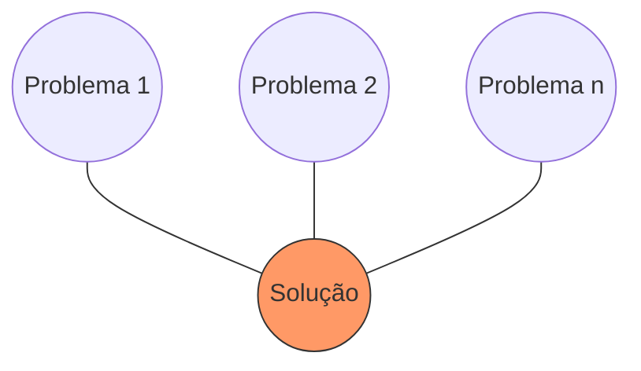
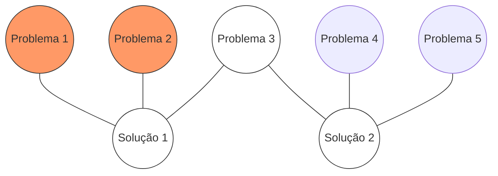
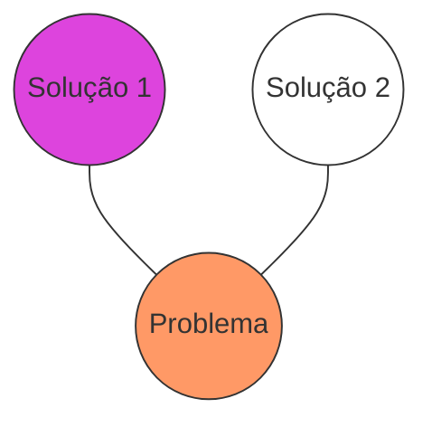

---
tags:
  - branding
dominio:
  - branding
Subdominio:
  - diagnostico-marca
tipo:
  - fonte
author:
  - EBAC
---
> [! Aqui se usa com marcas JÁ existentes]

Essa análise pode ser tanto feita internamente pela marca, quanto por uma consultoria externa de branding (existem várias), que fazem esse aprofundamento da marca, e pode demorar de 1 a 6 meses. É extenso assim porque a ideia é conversar com diversas pessoas - clientes, funcionários, parceiros - e entender as percepções da marca

### Diagnóstico de Marca

é uma análise muito mais abrangente de todos os aspectos da marca. Uma auditoria completa da marca pode levar um mês ou seis meses, dependendo do tamanho dos negócios e do escopo da arquitetura da marca. Essa é a única maneira real de avaliar a saúde de uma marca para garantir que ela esteja posicionada para o sucesso no futuro.

### Através do Diagnóstico da Marca, Você Poderá

- Definir e acompanhar os principais objetivos da sua estratégia de marca;
- Alinhar seus orçamentos para ajudar a alcançar seus objetivos;
- Fazer os investimentos de marketing certos para as necessidades da sua marca

## Como Conduzir?

Um diagnóstico de marca envolve auditar e analisar sua marca através de três etapas. Elas ajudarão a avaliar sua força atual e identificar oportunidades de construção e crescimento:

### Etapa 1

Entenda quem são seus clientes atuais e potenciais

### Etapa 2

Pontos fortes e vulnerabilidades

### Etapa 3

Entenda o estado atual da sua marca e da sua empresa

## Etapa 1: Entenda Quem São Seus Clientes Atuais e Potenciais

Avalie as percepções de sua marca entre aqueles que são seus clientes ideais, ou seja, as pessoas que provavelmente se tornarão leais e embaixadoras da sua marca. E quando falamos de cientes, falamos de TODOS que cercam a marca - o consumidor final, o fornecedor, quem trabalha pra você…

- Avalie como os clientes podem ser segmentados em grupos distintos e significativos; em seguida, determine os que melhor se adaptam à sua marca e o quanto você está adquirindo novos e retendo os atuais.
- Identifique as necessidades, desejos, ocasiões de uso e fatores de compra e recompra de seus principais segmentos.
- Determine como sua marca é percebida nessas dimensões.

Use dados do setor, sua própria pesquisa de mercado e até as redes sociais para reunir essas informações. Se você tiver muitos dados e recursos sofisticados de pesquisa e análise, suas descobertas serão muito específicas e projetáveis; caso contrário, use as informações que você tiver em mãos para criar hipóteses e projetar o futuro.

## Etapa 2: Pontos fortes e vulnerabilidades

Entenda seus pontos fortes e vulnerabilidades, bem como tendências de categoria e fatores macro que afetarão o desempenho da sua marca. Aqui aprofundamos a Análise SWOT.

- Use o conjunto de considerações do público-alvo para identificar seus principais concorrentes diretos e indiretos; avalie como sua marca se compara a eles nos critérios de tomada de decisão de seus clientes, por exemplo, preço, qualidade, conveniência etc.
- Identifique as principais tendências em sua categoria, como desenvolvimentos tecnológicos e concorrentes emergentes, e determine como eles podem impactar o desempenho da sua marca.
- Identifique fatores macro ambientais como clima econômico, influências culturais e tendências sociais e determine como eles afetam as percepções de sua marca.

Novamente, a profundidade e o escopo de sua análise dependem da quantidade e tipo de dados aos quais você tem acesso, mas a maioria dessas informações está disponível através de pesquisas na Internet, relatórios de tendências e auditorias de mídia.

## Etapa 3: Entenda o estado atual da sua marca e da sua empresa

- Analise seus produtos / serviços em termos de valor percebido, diferenciação e viabilidade a longo prazo.
- Avalie seus recursos, ativos e recursos atuais (humanos, financeiros, etc.) e identifique os que são sub alavancados.
- Avalie sua estratégia de marca atual e como ela é usada – é clara, focada e diferenciada? Todas as partes interessadas compartilham um entendimento comum? Está operacionalizado em toda a sua organização?

Você pode obter a maior parte do que precisa saber por meio de auto-avaliações organizacionais, entrevistas / pesquisas entre as principais partes interessadas externas e auditorias interna

## Design Thinking

### Conceitos:

> "Uma metodologia criativa e inovadora que coloca as pessoas no centro das soluções. Uma nova forma de pensar e solucionar problemas, focada na empatia e colaboração”.

> “Um processo criativo e critico que ajuda a organiza ideais, tomar decisões, melhorar situações e ganhar conhecimento".

## Etapas

| 1. DESCOBERTA                            | 2. INTERPRETAÇÃO                       | 3. IDEAÇÃO                                      | 4. EXPERIMENTAÇÃO                               | 5. EVOLUÇÃO                                                  |
| ---------------------------------------- | -------------------------------------- | ----------------------------------------------- | ----------------------------------------------- | ----------------------------------------------------- |
| Eu tenho um Desafio. **Como abordá-lo?** | Eu aprendi algo. **Como interpretar?** | Eu vejo uma oportunidade. **Como posso criar?** | Eu tenho uma ideia. **Como posso co Eu experimentei algo novo. **Como posso aprimorar?**  *  *  *  *  *  *  o  |

## Business Thinking, Design Thinking e Brand Thinking

### Business Thinking

Pensar em negócios é canalizar vários problemas em uma única solução.

Esse tipo de consultoria geralmente envolve um investimento alto e a solução geralmente é apresentada em um documento de 500 páginas. Não é exatamente um modelo amigável.

Em geral acabava nesse documento enorme, e sem execução.

Outro ponto, veja que se foca em uma só solução… difícil isso funcionar hoje em dia

### Design Thinking

Desenvolvido nos últimos 20 anos em resposta às ineficiências do pensamento empresarial.

Este modelo visa entender o problema, ou vários problemas, primeiro.

Em seguida, os protótipos são desenvolvidos rapidamente para várias soluções e testados com os consumidores para determinar qual solução funciona melhor.

→ resumindo: para cada problema, várias soluções

### Brand Thinking

O pensamento de marca combina componentes de ambos os modelos, canalizando vários problemas através de uma única lente, sua marca, e produzindo várias soluções possíveis. Essas soluções são rapidamente validadas por meio de testes e a melhor solução é apresentada.

→ teremos várias soluções possíveis para um mesmo problema, e sempre conectaremos isso à marca, estaremos e aprenderemos

## Mais sobre o Brand Thinking

Você agrupa problemas em conjuntos que passam pela lente da marca. Exemplo:

- Consumidores no geral começam a reclamar cada vez mais que querem embalagens recicláveis (preocupação com o meio ambiente).
- No seu call center, você tem várias reclamações sobre sua embalagem
- Seu time de procurement (de compras) avisa que a embalagem está muito cara

Certo, temos todos esses dados. Sabemos que nossa embalagem é cara e malfeita(na Matriz SWOT, seira uma Fraqueza), e o público no geral está clamando por embalagens mais sustentáveis (de novo, na SWOT, seria uma Oportunidade). Devemos nos perguntas:

- Faz parte da identidade - das delimitações - da minha marca, o valor de sustentabilidade?

Se sim, então cruzamos esses pontos da SWOT - a fraqueza de embalagem rui, com a oportunidade de clientes preocupados com a natureza - e aí chegamos a um denominador comum: procurar uma nova produtora para nossas embalagens que seja mais barata, e que faça embalagens recicláveis, para que seja ativamente comunicada nos canais de comunicação da marca com o cliente.