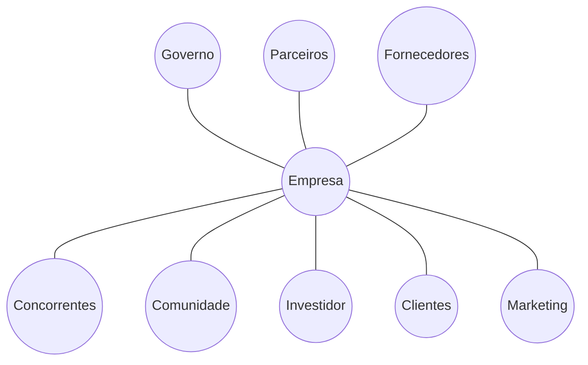
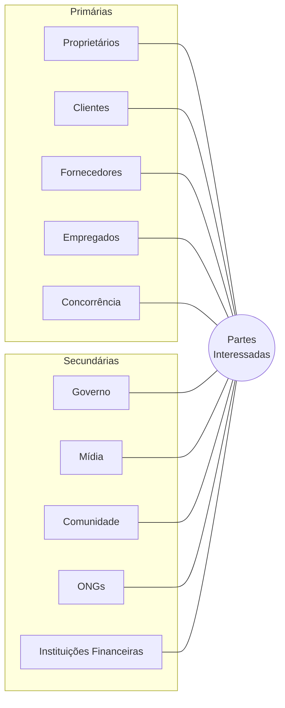
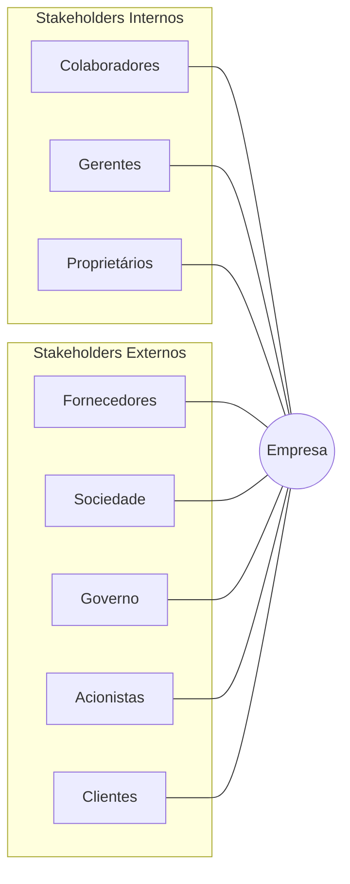

---
tags:
  - branding
dominio:
  - branding
Subdominio:
  - diagnostico-marca
tipo:
  - fonte
author:
  - EBAC
---
De forma simples, significa "partes interessadas" 

Conceito criado na década de 1980, pelo filósofo norte-americano Robert Edward Freeman, o stakeholder é qualquer indivíduo ou organização que, de alguma forma, é impactado pelas ações de uma determinada empresa. Em uma tradução livre para o português, o termo significa parte interessada.

A teoria é de que, para ter sucesso, qualquer empresa precisa criar algum tipo de valor(seja ele financeiro ou não) para uma série de interessados: clientes, fornecedores, funcionários, comunidades e investidores são alguns exemplos. Esses, no caso, são os principais stakeholders de uma organização.

O conceito chegou para modificar um comportamento muito comum dentro de algumas organizações de se preocupar exclusivamente com números, lucros, prejuízos e resultados.

Ou seja, qualquer pessoa que seja influenciada — positiva ou negativamente — pelas decisões da sua empresa é um stakeholder.

## Tipos:

Existem diferentes tipos e importâncias dentro desse mesmo grupo. De acordo com a situação, alguns stakeholders podem se tornar primários ou secundários — o que indica o grau de dependência.

A pergunta principal para serpará-los é: qual meu grau de dependência?

- Quanto mais dependente, mais primário ele é
- Quanto menos dependente, mais secundário ele é

### Internos e Externos

**Internos:** quem está diretamente ligado à organização, como funcionários, gestores, acionistas.

**Externos:** todas as pessoas que são “alvo” do negócio, mas não participam diretamente de sua operação.

# Stakeholders e Shareholders
![[Pasted image 20260813143941.png]]

# Stakeholder Mapping

O Stakeholder Mapping é uma ferramenta capaz de auxiliar e entender melhor quem são as partes interessadas em seu projeto/ marca.

Partindo para um conceito mais prático, essa ferramenta se sustenta por meio de dois indicadores muito importantes:

- Os níveis de interesse/disponibilidade de cada stakeholder
- Poder/influência dos stakeholders envolvidos

![[Pasted image 20260813144528.png]]

[[O Case Mapfre]]