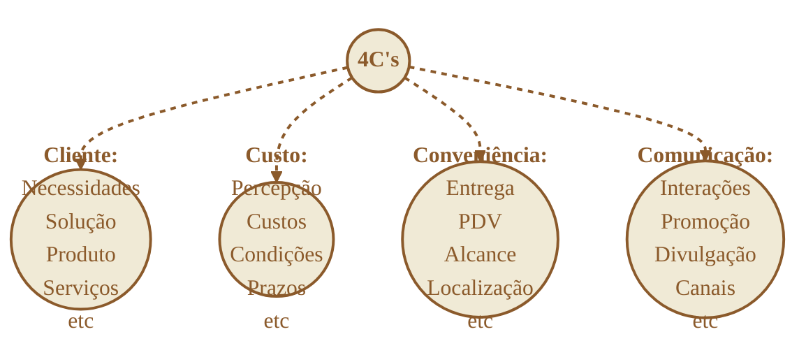
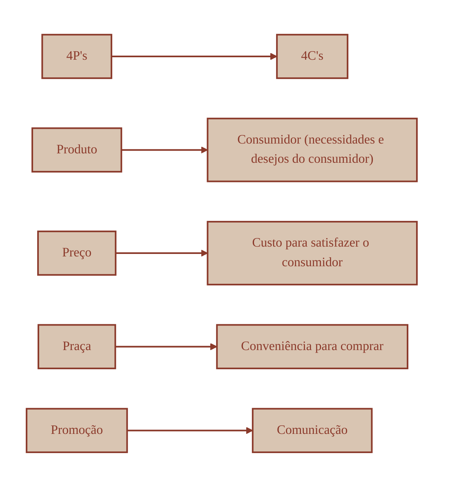

---
tags:
  - marketing
tipo:
  - fonte
dominio:
  - marketing
Subdominio:
  - marketing-tático-mix
---
## O Que É

O conceito de 4 Cs do marketing foi proposto por **Lauterborn** em 1990 como uma nova visão para o mix de marketing, abordando as estratégias de marketing com foco no cliente. Isso porque ele achava que os 4 Ps do marketing focavam muito no produto e pouco no público consumidor.

## Customer Centric

![[Pasted image 20260708131505.png|563]]
O “Cliente no Centro” ou a cultura centrada no cliente, como também é chamada, é um conceito que busca incentivar ações que priorizem uma boa experiência do cliente de ponta a ponta, da abordagem até o pós-venda. O objetivo é gerar fidelização e desenvolver evangelizadores da sua marca.

## 4 Ps x 4 Cs

## C de Cliente

A decisão de compra está na mão dos consumidores, o que está diretamente ligado aos conceitos de necessidades e desejos.

Por isso, a proposta é criar produtos e serviços que preencham um espaço na vida do consumidor a fim de se tornar relevante.

O cliente tem papel ativo na decisão de compra, por isso devemos ter uma oferta de qualidade e atraente.

## C de Custo

Esse conceito expande a ideia passada no preço dos **4 Ps do marketing**. O custo não é somente o preço que um produto ou serviço tem. Nesse caso, também consideramos o tempo que o cliente leva para fazer a compra, o quanto precisa se deslocar para chegar a loja, etc. Ou seja, é **todo esforço financeiro, físico e psicológico** que o consumidor precisa ter para adquirir um produto ou serviço. Essa é a relação **custo/benefício (valor)** que você provavelmente já ouviu falar. Ao perceber mais benefícios que custos, o cliente considera estar fazendo um bom negócio
![[custo x benefícios.svg|549]]

## C de Conveniência

Além de estruturar a localização e aspectos básicos relacionados a praça do seu negócio, é preciso pensar na conveniência para o cliente.

Nesse sentido, deve-se observar os hábitos de compra para tentar oferecer a melhor experiência possível, o que pode ser abrir um e-commerce, entregar delivery, atender nas mídias sociais, entre outras estratégias.

## C de Comunicação

Enquanto a promoção dos 4 Ps tem o objetivo de informar e estimular os clientes, a comunicação dos 4 Cs tem como objetivo criar uma interatividade maior a fim de obter melhores resultados.

Ou seja, a empresa precisa dialogar com os clientes para poder entendê-los melhor e assim validar seu plano de marketing.