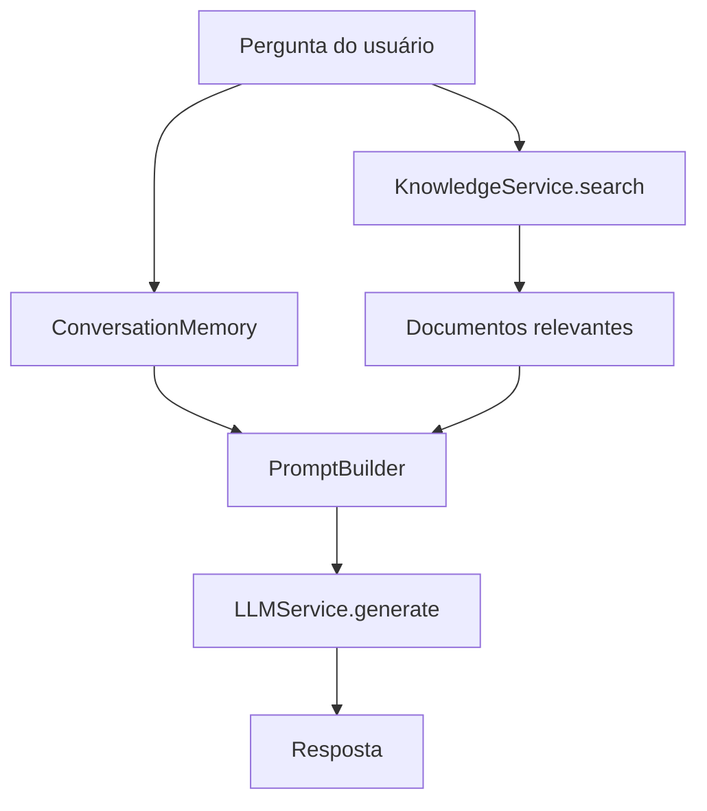
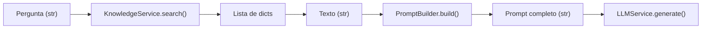
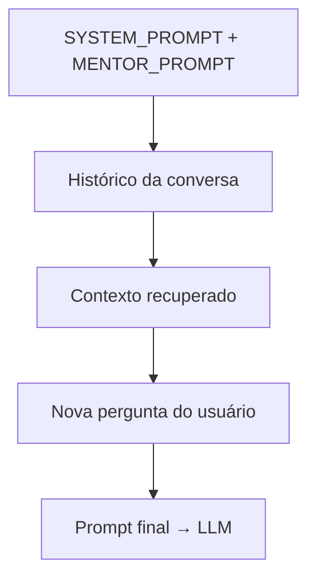
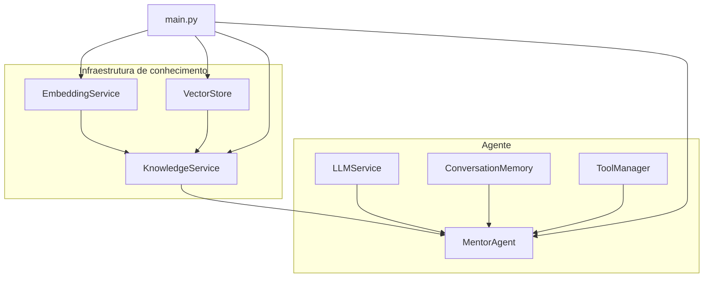

---
tipo:
  - conceito
dominio:
  - IA
Subdominio:
  - agentic-archtecture
  - RAG
tags:
  - IA
  - programação
  - inovação
---
# Etapa 1 — Injetar `KnowledgeService`

Você já possui isso no `MentorAgent` desde as aulas anteriores:

```python
knowledge_service: KnowledgeService
```

e:

```python
self.knowledge_service = knowledge_service
```

Portanto, **essa etapa provavelmente já está concluída no seu projeto**.

Seu `MentorAgent` deve ter algo nessa linha:

```python
class MentorAgent:

    def __init__(
        self,
        llm_service: LLMService,
        memory: ConversationMemory,
        tool_manager: ToolManager,
        knowledge_service: KnowledgeService
    ):
        self.llm_service = llm_service
        self.memory = memory
        self.tool_manager = tool_manager
        self.knowledge_service = knowledge_service
```

Isso é importante: **não vamos recriar uma dependência que já existe.**

### O que vem agora

A **Etapa 2** será a primeira mudança realmente nova:

> fazer o `MentorAgent.ask()` consultar o `KnowledgeService`.

E aqui quero que você tente primeiro, como fez na M7.5.

A ideia conceitual é simplesmente:

```text
pergunta
   ↓
MentorAgent
   ↓
KnowledgeService.search(...)
   ↓
resultados
```

**Não mexa ainda no `PromptBuilder`.**  
**Não tente montar o contexto ainda.**

Faça somente a recuperação dentro do `ask()`.

Quando terminar, me mande o `mentor_agent.py` e eu reviso antes de avançarmos para a Etapa 3.

---

# Etapa 2 - Retrieval

Faça o `MentorAgent` consultar o `KnowledgeService` durante o processamento de uma pergunta.

O resultado deverá ser utilizado como contexto.

## O que falta hoje

O `MentorAgent` já recebe o `KnowledgeService` por injeção de dependência, mas ainda não o usa no método `ask()`:

```Python
def ask(self, question: str) -> str:
	self.memory.add_user_message(question)
	history = self.memory.get_history()
	prompt = PromptBuilder.build(
	history,
	question
	
	)
```
O `KnowledgeService` já expõe o método `search()` que você precisa:

```Python
def search(

self,

query: str,

top_k: int = 3

):

query_embedding = self.embedding_service.generate_embedding(query)

return self.vector_store.search(

query_embedding,

top_k

)
```
## Implementação

### 1. Atualizar `PromptBuilder` para aceitar contexto

Em `app/prompts/prompt_builder.py`:

```Python
from app.prompts.system_prompt import SYSTEM_PROMPT
from app.prompts.mentor_prompt import MENTOR_PROMPT


class PromptBuilder:

    @staticmethod
    def build(history: str, question: str, context: str = "") -> str:

        context_section = ""
        if context:
            context_section = (
                f"Contexto relevante da base de conhecimento:\n"
                f"{context}\n\n"
            )

        return (
            f"{SYSTEM_PROMPT}\n\n"
            f"{MENTOR_PROMPT}\n\n"
            f"{context_section}"
            f"Histórico da conversa:\n"
            f"{history}\n\n"
            f"Nova pergunta do usuário:\n"
            f"{question}"
        )
```
### 2. Consultar o `KnowledgeService` no `MentorAgent`

Em `app/agents/mentor_agent.py`, altere o método `ask()`:

```Python
def ask(self, question: str) -> str:

    self.memory.add_user_message(question)

    history = self.memory.get_history()

    results = self.knowledge_service.search(question)

    context = "\n".join(
        result["text"] for result in results
    )

    prompt = PromptBuilder.build(
        history,
        question,
        context,
    )

    response = self.llm_service.generate(prompt)

    if response["type"] == "text":
        self.memory.add_assistant_message(response["content"])
        return response["content"]

    elif response["type"] == "tool_call":
        result = self.tool_manager.execute(
            tool_name=response["tool"],
            tool_input=response["input"]
        )

        result_text = str(result)

        self.memory.add_assistant_message(result_text)

        return result_text
```

## Fluxo resultante

Estou em **modo Ask**, então não posso editar os arquivos por você. Abaixo está exatamente o que implementar — se quiser que eu aplique as mudanças automaticamente, mude para o **modo Agent**.

## O que falta hoje

O `MentorAgent` já recebe o `KnowledgeService` por injeção de dependência, mas ainda **não o usa** no método `ask()`:

```22:31:c:\Users\caioe\OneDrive\Documentos\Projetos\prometheus\prometheus-mentor\app\agents\mentor_agent.py
    def ask(self, question: str) -> str:

        self.memory.add_user_message(question)

        history = self.memory.get_history()

        prompt = PromptBuilder.build(
             history, 
             question
             )
```

O `KnowledgeService` já expõe o método `search()` que você precisa:

```34:44:c:\Users\caioe\OneDrive\Documentos\Projetos\prometheus\prometheus-mentor\app\knowledge\knowledge_service.py
    def search(
            self,
            query: str,
            top_k: int = 3
    ):
        query_embedding = self.embedding_service.generate_embedding(query)

        return self.vector_store.search(
            query_embedding,
            top_k
        )
```

## Implementação

### 1. Atualizar `PromptBuilder` para aceitar contexto

Em `app/prompts/prompt_builder.py`:

```python
from app.prompts.system_prompt import SYSTEM_PROMPT
from app.prompts.mentor_prompt import MENTOR_PROMPT


class PromptBuilder:

    @staticmethod
    def build(history: str, question: str, context: str = "") -> str:

        context_section = ""
        if context:
            context_section = (
                f"Contexto relevante da base de conhecimento:\n"
                f"{context}\n\n"
            )

        return (
            f"{SYSTEM_PROMPT}\n\n"
            f"{MENTOR_PROMPT}\n\n"
            f"{context_section}"
            f"Histórico da conversa:\n"
            f"{history}\n\n"
            f"Nova pergunta do usuário:\n"
            f"{question}"
        )
```

### 2. Consultar o `KnowledgeService` no `MentorAgent`

Em `app/agents/mentor_agent.py`, altere o método `ask()`:

```python
def ask(self, question: str) -> str:

    self.memory.add_user_message(question)

    history = self.memory.get_history()

    results = self.knowledge_service.search(question)

    context = "\n".join(
        result["text"] for result in results
    )

    prompt = PromptBuilder.build(
        history,
        question,
        context,
    )

    response = self.llm_service.generate(prompt)

    if response["type"] == "text":
        self.memory.add_assistant_message(response["content"])
        return response["content"]

    elif response["type"] == "tool_call":
        result = self.tool_manager.execute(
            tool_name=response["tool"],
            tool_input=response["input"]
        )

        result_text = str(result)

        self.memory.add_assistant_message(result_text)

        return result_text
```

## Fluxo resultante



## Como testar

Com o `main.py` atual, os documentos sobre Bitcoin, Python e redes neurais já estão indexados. Ao rodar o programa e perguntar algo como *"Qual é a quantidade máxima de Bitcoins?"*, o agente deve:

1. Buscar semanticamente o documento sobre Bitcoin
2. Incluir esse texto no prompt como contexto
3. Responder com base nessa informação

## Resumo das mudanças

| Arquivo | Mudança |
|---------|---------|
| `mentor_agent.py` | Chamar `self.knowledge_service.search(question)` e passar o resultado ao prompt |
| `prompt_builder.py` | Novo parâmetro `context` incluído no prompt final |

---
# Etapa 3 - Contexto

A boa notícia: você já fez a maior parte da Etapa 3 no `mentor_agent.py`. O trecho abaixo é exatamente a transformação que o curso pede — sem criar classe nova:

```Python
results = self.knowledge_service.search(question)

context = "\n".join(
    result["text"] for result in results
)
```

O objetivo aqui não é criar um `ContextBuilder` ou similar. É entender como os dados mudam de forma ao longo do fluxo RAG:


### 1. Entrada: pergunta em texto
```python
question = "Qual é a quantidade máxima de Bitcoins?"
```

### 2. Retrieval: dados estruturados

O `search()` devolve uma lista de dicionários, não texto pronto:
```Python
[
    {"text": "Bitcoin possui uma oferta máxima de 21 milhões de moedas.", "score": 0.87, ...},
    {"text": "Python é uma linguagem de programação...", "score": 0.42, ...},
    ...
]
```

O LLM não consome isso diretamente — ele precisa de string.

### 3. Transformação: lista → contexto textual
É aqui que entra a Etapa 3. Você pega só o que importa (`text`) e junta em uma string:

```Python
results = self.knowledge_service.search(question)

context = "\n".join(
    result["text"] for result in results
)
```

Resultado

```plaintext
Bitcoin possui uma oferta máxima de 21 milhões de moedas.
Python é uma linguagem de programação de alto nível.
Redes neurais artificiais são modelos computacionais.
```

### 4. Inclusão no prompt

O `PromptBuilder` recebe o contexto já formatado e o encaixa no prompt:

```Python
prompt = PromptBuilder.build(history, question, context)
```

Responsabilidades separadas:

- `MentorAgent` — orquestra e transforma `results` → `context`
- `PromptBuilder` — monta o prompt final
- `KnowledgeService` — busca semântica (não formata texto para o LLM)

---

## Versão mais explícita (só para entender o fluxo)

Se quiser deixar o passo mais visível, sem criar classe nova, pode usar um loop:

```Python
results = self.knowledge_service.search(question)

context_parts = []

for result in results:
    context_parts.append(result["text"])

context = "\n".join(context_parts)
```

É equivalente ao `join` com generator que você já tem — só deixa o fluxo mais legível para estudo.

---
## O que não fazer nesta etapa

|Evitar|Por quê|
|---|---|
|Criar `ContextFormatter`, `ContextBuilder`, etc.|O curso pede para não criar classe nova|
|Formatar contexto dentro do `KnowledgeService`|Ele deve retornar dados; a orquestração fica no agente|
|Formatar contexto dentro do `PromptBuilder`|Ele recebe string pronta; não conhece a estrutura dos `results`|

---

## Atenção: bug no `prompt_builder.py`

Há um erro de sintaxe que impede o programa de rodar:
```python
context_section = {
    f"Contexto relevante da base de conhecimento:\n"
    f"{context\n\n}"
}
```

Deveria ser parênteses (string), não chaves (set), e `{context\n\n}` não é f-string válida. A forma correta:
```Python
context_section = (
    f"Contexto relevante da base de conhecimento:\n"
    f"{context}\n\n"
)
```

## Resumo

| Etapa         | O que faz                        | Onde                                              |
| ------------- | -------------------------------- | ------------------------------------------------- |
| 2 — Retrieval | Consulta a base de conhecimento  | `knowledge_service.search(question)`              |
| 3 — Contexto  | Converte lista de dicts em texto | `"\n".join(result["text"] for result in results)` |
| Prompt        | Insere o contexto no prompt      | `PromptBuilder.build(..., context)`               |

Com isso, a Etapa 3 está concluída conceitualmente. A próxima etapa do curso provavelmente vai refinar como esse contexto entra no prompt (formatação, ordem, instruções ao LLM para usar o contexto, etc.).

---

# Etapa 4 - `PromptBuilder`

## O que muda

A diferença principal em relação ao que você tem hoje é a **ordem** das seções no prompt.

**Hoje** (ordem incorreta para a etapa):

```text
instruções → contexto → histórico → pergunta
```

**O curso pede:**

```text
instruções → histórico → contexto recuperado → pergunta
```

O `MentorAgent` já passa o `context` corretamente — a mudança fica só no `PromptBuilder`.

---

## Implementação sugerida

Substitua o conteúdo de `app/prompts/prompt_builder.py` por:

```python
from app.prompts.system_prompt import SYSTEM_PROMPT
from app.prompts.mentor_prompt import MENTOR_PROMPT


class PromptBuilder:

    @staticmethod
    def build(history: str, question: str, context: str = "") -> str:

        context_section = ""
        if context:
            context_section = (
                f"Contexto recuperado:\n"
                f"{context}\n\n"
            )

        return (
            f"{SYSTEM_PROMPT}\n\n"
            f"{MENTOR_PROMPT}\n\n"
            f"Histórico da conversa:\n"
            f"{history}\n\n"
            f"{context_section}"
            f"Nova pergunta do usuário:\n"
            f"{question}"
        )
```

---

## Fluxo visual



---

## Dois pontos de atenção

**1. Bug de sintaxe na linha 14**

`{context\n\n}` não é f-string válida. Use `{context}\n\n` fora da interpolação, como no exemplo acima.

**2. Código redundante no `MentorAgent`**

Você monta `context_parts` no loop, mas não usa — só o `join` abaixo. Pode remover o loop e manter só:

```python
context = "\n".join(
    result["text"] for result in results
)
```

---

## Exemplo de prompt gerado

Para a pergunta *"Qual é a quantidade máxima de Bitcoins?"*, o prompt ficaria assim:

```text
[instruções do SYSTEM_PROMPT]

[instruções do MENTOR_PROMPT]

Histórico da conversa:
[histórico vazio ou mensagens anteriores]

Contexto recuperado:
Bitcoin possui uma oferta máxima de 21 milhões de moedas.
Python é uma linguagem de programação de alto nível.
...

Nova pergunta do usuário:
Qual é a quantidade máxima de Bitcoins?
```

---

## Resumo

| Arquivo | Mudança |
|---------|---------|
| `prompt_builder.py` | Reordenar seções + corrigir f-string |
| `mentor_agent.py` | Nenhuma mudança obrigatória (opcional: remover loop redundante) |

Quer que eu aplique isso no projeto? Mude para o **modo Agent** e peça.

---
# Etapa 5 - Integração

Atualização de `main.py`

## Parte 5 — Integração no `main.py`

Boa notícia: **a cadeia de dependências já está montada corretamente** no seu `main.py`. O fluxo pedido pelo curso já existe:

```20:30:c:\Users\caioe\OneDrive\Documentos\Projetos\prometheus\prometheus-mentor\app\main.py
    # Instanciar o serviço de embedding
    embedding_service = EmbeddingService()

    # Instanciar o VectorStore
    vector_store = VectorStore()

    # Instanciar o serviço de conhecimento
    knowledge_service = KnowledgeService(
        embedding_service,
        vector_store
    )
```

```59:65:c:\Users\caioe\OneDrive\Documentos\Projetos\prometheus\prometheus-mentor\app\main.py
    # Cria o agente, recebendo o serviço
    mentor = MentorAgent(
        llm_service, 
        memory,
        tool_manager,
        knowledge_service,
        )
```

---

## O que a etapa pede vs. o que você já tem

```text
EmbeddingService  ✅  linha 21
       ↓
VectorStore       ✅  linha 24
       ↓
KnowledgeService  ✅  linhas 27–30
       ↓
MentorAgent       ✅  linhas 60–65
```

A integração funcional está feita. O que falta é **organizar** o `main.py` para refletir essa arquitetura de forma clara — e remover código de teste das aulas anteriores.

---

## O que ajustar

### 1. Remover o teste manual de `search()`

Este bloco era útil nas aulas do `VectorStore`, mas agora a busca acontece dentro do `MentorAgent`:

```46:55:c:\Users\caioe\OneDrive\Documentos\Projetos\prometheus\prometheus-mentor\app\main.py
    results = knowledge_service.search(
        "Qual é a quantidade máxima de Bitcoins?"
    )

    for result in results:
        print("\nDocumento:")
        print(result["text"])

        print("Score:")
        print(result["score"])
```

Pode remover. A recuperação passa a ser testada pelo loop interativo.

### 2. Manter a ingestão de documentos

Os `add_document()` devem permanecer — sem eles, o `VectorStore` fica vazio e o RAG não tem o que recuperar:

```python
knowledge_service.add_document(
    "Bitcoin possui uma oferta máxima de 21 milhões de moedas."
)
# ... demais documentos
```

### 3. Organizar com comentários que espelhem a cadeia

Versão sugerida do `main.py`:

```python
from app.agents.mentor_agent import MentorAgent
from app.services.llm_service import LLMService
from app.memory.conversation_memory import ConversationMemory
from app.tools.tool_manager import ToolManager
from app.knowledge.knowledge_service import KnowledgeService
from app.knowledge.embedding_service import EmbeddingService
from app.knowledge.vector_store import VectorStore


def main():

    # ===== Infraestrutura de conhecimento =====

    embedding_service = EmbeddingService()
    vector_store = VectorStore()

    knowledge_service = KnowledgeService(
        embedding_service,
        vector_store,
    )

    # ===== Ingestão de documentos =====

    knowledge_service.add_document(
        "Bitcoin possui uma oferta máxima de 21 milhões de moedas."
    )

    knowledge_service.add_document(
        "Python é uma linguagem de programação de alto nível."
    )

    knowledge_service.add_document(
        "Redes neurais artificiais são modelos computacionais."
    )

    
	# ===== Demais dependências =====
    llm_service = LLMService()
    memory = ConversationMemory()
    tool_manager = ToolManager()

    # ===== Agente =====

    mentor = MentorAgent(
        llm_service,
        memory,
        tool_manager,
        knowledge_service,
    )

    # ===== Loop de questionamento =====

    while True:
        question = input("\nPergunte alguma coisa: ")

        if question.lower() == "sair":
            print("\nAté a próxima!")
            break

        answer = mentor.ask(question)

        print("\nPrometheus-Mentor:\n")
        print(answer)


if __name__ == "__main__":
    main()
```

---

## Árvore completa de dependências



>[! ]
>O `main.py` é o **composition root**: único lugar que conhece todas as implementações e monta o grafo de dependências.

---

## Como validar a integração

1. Rode o programa
2. Pergunte: *"Qual é a quantidade máxima de Bitcoins?"*
3. O fluxo esperado:
   - `MentorAgent.ask()` → `KnowledgeService.search()`
   - `EmbeddingService` gera embedding da pergunta
   - `VectorStore` retorna documentos similares
   - Contexto entra no prompt via `PromptBuilder`
   - `LLMService` responde com base no contexto recuperado

---

## Resumo

| Item | Status |
|------|--------|
| Cadeia `EmbeddingService → VectorStore → KnowledgeService → MentorAgent` | Já implementada |
| Injeção no `MentorAgent` | Já implementada |
| Remover teste manual de `search()` | Recomendado |
| Reorganizar comentários/seções | Recomendado |

A Parte 5 está essencialmente concluída — falta só a limpeza organizacional. Quer que eu aplique isso no projeto? Mude para o **modo Agent** e peça.

---

# Correção Preliminar:
Sim. Agora temos material suficiente para fazer a revisão **do que você realmente implementou**, sem voltar etapas.

E já adianto: **a arquitetura está correta para o objetivo da M7.006**. Há, porém, alguns pontos que eu quero que você entenda antes de considerarmos a aula encerrada.

## 1. `MentorAgent` — correto

Você fez:

```python
results = self.knowledge_service.search(question)
```

Isso é exatamente a separação que queríamos:

```text
MentorAgent
      │
      │ pergunta
      ▼
KnowledgeService
      │
      ├── EmbeddingService
      │
      └── VectorStore
```

O `MentorAgent` **não sabe** como o embedding é gerado nem como a similaridade é calculada.

Depois você transforma os resultados em contexto:

```python
context = "\n".join(
    result["text"] for result in results
)
```

Isso também está correto para esta aula. Não criamos uma classe `ContextBuilder`, porque o desafio explicitamente pediu para não abstrairmos isso ainda.

### E depois:

```python
prompt = PromptBuilder.build(
    history,
    question,
    context,
)
```

Perfeito.

O `MentorAgent` reúne os dados; o `PromptBuilder` monta o prompt.

---

# 2. `PromptBuilder` — correto

A alteração principal foi:

```python
def build(
    history: str,
    question: str,
    context: str = ""
) -> str:
```

E você criou:

```python
context_section = ""

if context:
    context_section = (
        f"Contexto relevante da base de conhecimento:\n"
        f"{context}\n\n"
    )
```

Isso é interessante porque mantém o `context` **opcional**.

Ou seja, conceitualmente:

```text
sem contexto
      ↓
prompt normal
```

e:

```text
com contexto
      ↓
prompt + contexto
```

Para a M7.006, está adequado.

---

# 3. `KnowledgeService` — correto

Seu fluxo:

```python
def search(
        self,
        query: str,
        top_k: int = 3
):
    query_embedding = self.embedding_service.generate_embedding(query)

    return self.vector_store.search(
        query_embedding,
        top_k
    )
```

Está exatamente onde essa lógica deveria estar.

Observe a divisão:

```text
MentorAgent
    │
    │ search("...")
    ▼
KnowledgeService
    │
    ├── transforma query em embedding
    │
    ▼
EmbeddingService
    │
    ▼
query_embedding
    │
    ▼
VectorStore
    │
    ▼
resultados
```

O `MentorAgent` não precisa conhecer nenhum desses detalhes.

Isso é **encapsulamento arquitetural**, e não apenas "organização de código".

---

# 4. `main.py` — correto

Aqui você fez uma coisa particularmente boa:

```python
embedding_service = EmbeddingService()
vector_store = VectorStore()

knowledge_service = KnowledgeService(
    embedding_service,
    vector_store
)
```

e depois:

```python
mentor = MentorAgent(
    llm_service, 
    memory,
    tool_manager,
    knowledge_service,
)
```

Temos finalmente a árvore de dependências que construímos ao longo das aulas:

```text
main.py
│
├── LLMService
├── ConversationMemory
├── ToolManager
│
└── KnowledgeService
      │
      ├── EmbeddingService
      │
      └── VectorStore
```

E isso é exatamente o que queríamos alcançar.

---

# 5. O ponto mais importante: o RAG agora está realmente conectado

Antes da M7.006:

```text
Usuário
   ↓
MentorAgent
   ↓
PromptBuilder
   ↓
LLM
```

O conhecimento existia **paralelamente**, mas não participava da geração.

Agora:

```text
Usuário
   ↓
MentorAgent
   │
   ├───────────────┐
   │               │
   ▼               ▼
Memory       KnowledgeService
                  │
                  ▼
             Retrieval
                  │
                  ▼
              Contexto
                  │
                  └──────────┐
                             ▼
                       PromptBuilder
                             │
                             ▼
                        LLMService
                             │
                             ▼
                          resposta
```

**Esse é o marco importante da M7.006.**

Você acabou de transformar o conjunto de componentes que construímos nas aulas anteriores em um **pipeline de RAG end-to-end**.

---

# 6. Mas há uma coisa que quero que você observe

Você está usando:

```python
results = self.knowledge_service.search(question)
```

diretamente em **toda pergunta**.

Isso significa que, atualmente:

> Toda pergunta consulta a base de conhecimento.

Isso **não é um erro para a M7.006**.

Na verdade, o próprio desafio desta aula pediu para fazer o Mentor consultar o `KnowledgeService` durante o processamento da pergunta.

Mas existe uma diferença importante:

### O que temos agora

```text
Pergunta
   ↓
sempre faz retrieval
   ↓
LLM
```

### O que teremos futuramente

```text
Pergunta
   ↓
Mentor decide
   │
   ├── não precisa de conhecimento → LLM
   │
   └── precisa → KnowledgeService
                         ↓
                      contexto
                         ↓
                         LLM
```

**Não vamos implementar isso agora.**

Isso pertence à evolução posterior do sistema de decisão do agente.

---

# 7. Uma pequena observação de qualidade

No `PromptBuilder`, você escreveu:

```python
context_section= ""
```

e:

```python
f"Contexto relevante da base de conhecimento:\n"
```

Eu só faria a melhoria estética:

```python
context_section = ""
```

e:

```python
f"Contexto relevante da base de conhecimento:\n"
```

Nada arquitetural. É apenas PEP 8/espaçamento.

---

# 8. Agora falta a prova final

**A implementação da M7.006 está essencialmente concluída.**

Mas eu **não encerraria a aula ainda**.

Falta o teste que prova que as peças realmente estão trabalhando juntas.

Execute o Prometheus e faça:

> **Qual é a quantidade máxima de Bitcoins?**

O que queremos observar é:

```text
Pergunta
   ↓
MentorAgent
   ↓
KnowledgeService.search()
   ↓
EmbeddingService
   ↓
VectorStore
   ↓
Bitcoin possui uma oferta máxima de 21 milhões...
   ↓
context
   ↓
PromptBuilder
   ↓
LLM
   ↓
Resposta
```

### E aqui está o teste arquitetural de verdade:

A resposta do Mentor deve ser capaz de mencionar **21 milhões** porque esse conhecimento foi colocado no VectorStore e recuperado pelo pipeline.

Não estamos interessados apenas em "o programa rodou".

Queremos provar:

> **o conhecimento armazenado foi recuperado e incorporado ao prompt que chegou ao LLM.**

Se isso acontecer, **M7.006 está concluída**.

Depois disso, podemos fazer a revisão final da aula e gerar o **CHANGELOG M7.006**, registrando exatamente o que você construiu e quais abstrações novas entraram no Prometheus.