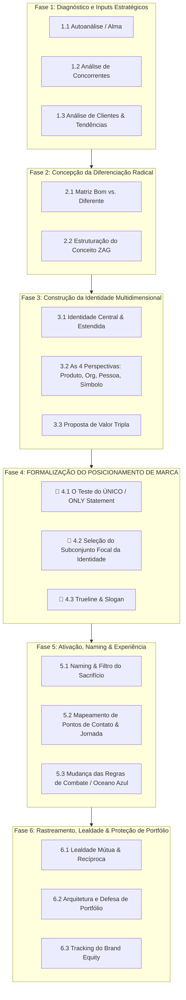

---
tags:
  - branding
  - estrategia
  - metodologia
  - aaker
  - neumeier
tipo:
  - framework
---
# Metodologia Integrada de Branding: Aaker & Neumeier

Esta metodologia unifica o **Sistema de Identidade e Brand Equity de David Aaker** (*Building Strong Brands*) com o processo de **Diferenciação Radical e Foco de Marty Neumeier** (*ZAG*).

Ela conecta o diagnóstico de mercado, a construção da identidade multidimensional, a formalização do posicionamento e a implementação nos pontos de contato.

---

## 🧭 Visão Geral do Framework

---

## 🔍 Detalhamento das Fases

### Fase 1: Diagnóstico e Inputs Estratégicos (Análise Estratégica)
*Objetivo: Coletar os dados de entrada para fundamentar a identidade e o posicionamento.*

- **1.1. Autoanálise (Alma da Marca)**
  - *Paixão & Teste do Obituário*: Onde está a energia vital da equipe? Se a empresa falisse em 25 anos, o que o obituário diria?
  - *Propósito Central*: A razão fundamental de existir além do lucro (em ≤ 12 palavras).
  - *Visão Concreta*: A imagem tangível e inspiradora do futuro.
- **1.2. Análise de Concorrentes (Brandscape)**
  - Mapear os líderes da categoria (#1 e #2) e entender a hierarquia do mercado.
  - Identificar pontos fortes, fracos e vulnerabilidades da concorrência.
  - Escolher o **Inimigo** (o padrão ultrapassado ou o concorrente líder a ser confrontado pelo princípio do contraste).
- **1.3. Análise de Clientes & Tendências**
  - Mapear a **Onda** (micro e macro tendências culturais, sociais e tecnológicas).
  - Identificar estados de necessidade e *Jobs-to-be-Done* (necessidades não atendidas).
  - Mapear a comunidade (*Quem Ama Você*).

---

### Fase 2: Concepção da Diferenciação Radical (Conceito ZAG)
*Objetivo: Identificar o Espaço Branco onde a marca não disputará por atributos genéricos.*

- **2.1. Matriz Bom vs. Diferente**
  - Mapear a oferta no quadrante superior direito (alto desempenho + alta diferenciação radical).
- **2.2. Estruturação do Conceito ZAG**
  - Definir a tese de ruptura frente ao movimento dominante da concorrência (*"Quando todos marcam zig, faça zag"*).

---

### Fase 3: Construção da Identidade Multidimensional (Sistema Aaker)
*Objetivo: Criar o "arsenal completo" da marca, evitando a armadilha de reduzi-la apenas a atributos de produto.*

- **3.1. Identidade Central vs. Estendida**
  - *Identidade Central*: A essência atemporal que permanece constante na expansão de novos produtos/mercados.
  - *Identidade Estendida*: Elementos organizados que fornecem textura, profundidade e contexto.
- **3.2. As 4 Perspectivas da Identidade**
  1. *Marca como Produto*: Escopo da categoria, atributos do produto, qualidade/valor percebido, usos, usuários e país de origem.
  2. *Marca como Organização*: Atributos organizacionais (inovação, cultura, ética, confiabilidade) e escopo local vs. global.
  3. *Marca como Pessoa*: Personalidade da marca (adjetivos de caráter) e tipo de relacionamento marca-cliente.
  4. *Marca como Símbolo*: Metáforas visuais, imagens marcantes e herança da marca.
- **3.3. Proposta de Valor Tripla**
  - *Benefícios Funcionais*: Desempenho e utilidade prática.
  - *Benefícios Emocionais*: Como o cliente se sente ao usar a marca.
  - *Benefícios de Autoexpressão*: O que o uso da marca comunica sobre a identidade do próprio cliente.

---

### 🎯 Fase 4: FORMALIZAÇÃO DO POSICIONAMENTO DE MARCA
*Objetivo: Selecionar o subconjunto da Identidade Multidimensional que será **comunicado ativamente agora** para obter vantagem competitiva sobre os concorrentes.*

> 💡 **Identidade vs. Posicionamento**: A Identidade é a visão ampla e completa de como a marca aspira ser percebida (Fase 3). O Posicionamento é a **lente focal** escolhida para a batalha de comunicação atual (Fase 4).

- **4.1. O Teste do "ÚNICO" (*ONLY Statement*)**
  > *"Nossa marca é a ÚNICA [categoria] que [diferencial ZAG] para [público-alvo] em [geografia] num momento de [tendência]."*
- **4.2. Seleção do Subconjunto Focal da Identidade**
  - Escolher qual benefício da Proposta de Valor liderará a comunicação ativa.
  - Definir a vantagem competitiva direta e a razão para o cliente acreditar (*Reason to Believe*).
- **4.3. Trueline & Slogan**
  - *Trueline*: A proposição de valor interna e inquestionável (o fato verdadeiro da marca).
  - *Slogan*: A tradução externa memorável e tribal do posicionamento.

---

### Fase 5: Ativação, Naming & Experiência (Execução)
*Objetivo: Traduzir o Posicionamento formalizado em pontos de contato tangíveis e experiências reais.*

- **5.1. Naming & O Jogo do Sacrifício**
  - Validação de nome: curto, distinto, defensável e apropriado.
  - *Filtro do Sacrifício*: Cortar produtos, mensagens ou iniciativas que desfocam ou contradizem o posicionamento ZAG.
- **5.2. Mapeamento de Pontos de Contato & Jornada**
  - Mapear a jornada completa do cliente (conscientização, consideração, compra e lealdade).
  - Concentrar o orçamento de marketing nos pontos de contato estratégicos de maior retorno (ROI/ROAS).
- **5.3. Mudança das Regras de Combate (Oceano Azul)**
  - Redefinir a forma como o cliente interage com a oferta, fugindo da concorrência direta no "oceano vermelho".

---

### Fase 6: Rastreamento, Lealdade & Proteção de Portfólio
*Objetivo: Sustentar a posição conquistada e proteger o valor da marca no longo prazo.*

- **6.1. Lealdade Mútua & Recíproca**
  - Construir programas de fidelidade baseados em relacionamentos e benefícios reais (evitando armadilhas de descontos que destroem margem).
- **6.2. Arquitetura e Defesa de Portfólio**
  - Organizar o portfólio (*House of Brands* vs. *Branded House*).
  - Proteger a marca contra as 4 ameaças: *Contágio, Confusão, Contradição e Complexidade*.
- **6.3. Tracking do Brand Equity (Rastreamento)**
  - Monitorar continuamente se a **Imagem de Marca** percebida pelo mercado está convergindo para o **Posicionamento de Marca** pretendido.
  - Avaliar periodicamente as 4 dimensões do Equity: *Conscientização (Awareness)*, *Qualidade Percebida*, *Lealdade* e *Associações*.

---

## 📌 Referências e Leituras no Vault
- David A. Aaker - [Building Strong Brands - HUB.md](file:///c:/Users/caioe/OneDrive/Documentos/Obsidian%20Vault/Second%20Brain/3.%20Recursos/Estudos/1.%20Livros/Building%20Strong%20Brands/Building%20Strong%20Brands%20-%20HUB.md)
- Marty Neumeier - [ZAG - HUB.md](file:///c:/Users/caioe/OneDrive/Documentos/Obsidian%20Vault/Second%20Brain/3.%20Recursos/Estudos/1.%20Livros/ZAG/ZAG%20-%20HUB.md)
- Diagrama SVG original - [sistema_identidade_marca.svg](file:///C:/Users/caioe/OneDrive/Documentos/Obsidian%20Vault/Second%20Brain/4.%20Arquivos/SVGs/sistema_identidade_marca.svg)
